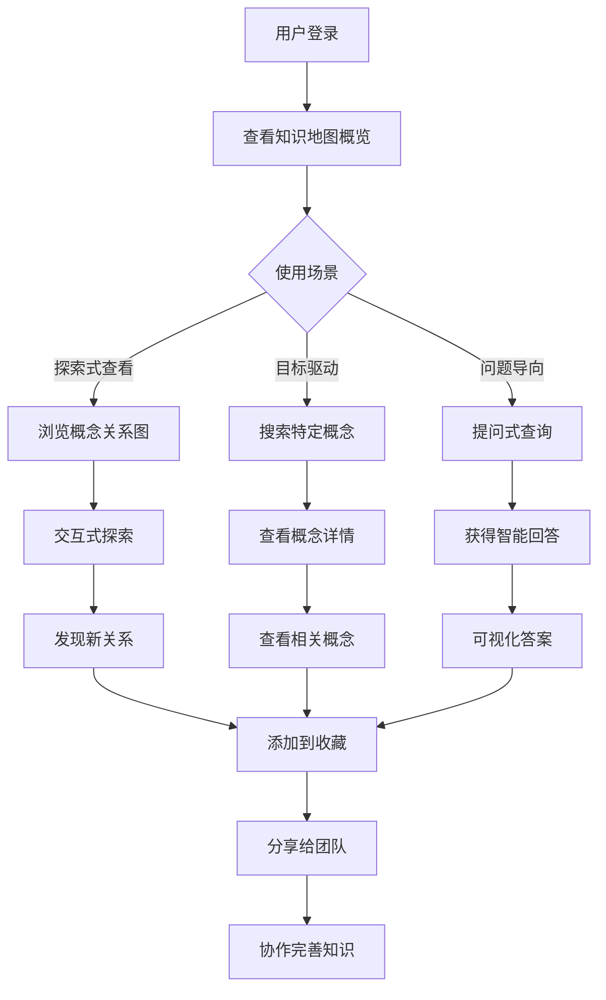
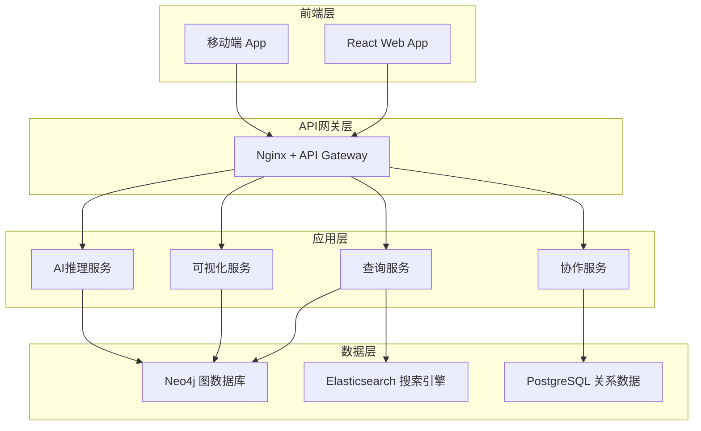

# EFIAgent知识图谱功能产品重新设计方案

## 1. 产品定位与价值主张

### 1.1 核心问题诊断

**当前问题：**
- ❌ 功能过于抽象复杂，用户看不懂是用来做什么的
- ❌ 缺乏明确的使用场景和用户价值
- ❌ 技术架构过于复杂，实现成本高
- ❌ 与实际业务需求脱节

**用户真实需求：**
- ✅ 希望能够快速理解和管理企业中的各种概念和关系
- ✅ 需要可视化的方式展示业务架构和数据流
- ✅ 希望能够通过自然语言查询复杂的业务关系
- ✅ 需要智能推荐和建议来优化业务流程

### 1.2 重新定位：企业知识地图

**产品定位：**
> **EFIAgent知识地图** - 像使用Google Maps一样理解和管理企业知识

**核心价值：**
1. **可视化企业架构** - 一目了然的业务概念关系图
2. **智能问答导航** - 自然语言查询企业知识
3. **自动化知识发现** - AI驱动的隐含关系挖掘
4. **协作式知识管理** - 团队共建维护企业知识库

## 2. 目标用户与使用场景

### 2.1 核心用户群体

#### A. 业务分析师 (主要用户)
**痛点：**
- 难以快速理解复杂的业务流程
- 跨部门沟通时缺乏统一的概念理解
- 业务规则和逻辑分散在各个文档中

**使用场景：**
- 🔍 **快速理解业务** - "销售订单处理流程涉及哪些系统？"
- 📊 **影响分析** - "如果修改客户信息，会影响到哪些业务流程？"
- 🔄 **流程优化** - "显示最长的业务链路，找出瓶颈点"

#### B. 系统架构师 (重要用户)
**痛点：**
- 系统间的依赖关系不清晰
- 数据流向复杂，难以追踪
- 技术文档与实际实现脱节

**使用场景：**
- 🏗️ **架构可视化** - "显示所有与支付系统相关的服务"
- 🔗 **依赖分析** - "用户认证系统被哪些服务依赖？"
- 📈 **性能优化** - "找出数据传输瓶颈路径"

#### C. 产品经理 (扩展用户)
**痛点：**
- 需求变更时影响范围难以评估
- 产品功能之间的关系复杂
- 缺乏全局的产品视图

**使用场景：**
- 🎯 **需求分析** - "新增批量导出功能需要修改哪些模块？"
- 📱 **功能关系** - "用户管理相关功能有哪些？"
- 🚀 **产品规划** - "显示用户注册到首次购买的全流程"

### 2.2 典型使用流程



## 3. 简化的产品形态设计

### 3.1 核心功能模块

#### 🗺️ 知识地图 (Knowledge Map)
**可视化概念关系网络**
```
功能：
- 交互式概念网络图
- 多层级缩放查看
- 关系类型筛选
- 时间轴变化追踪
```

#### 🔍 智能搜索 (Smart Search)
**自然语言问答系统**
```
功能：
- 自然语言查询
- 模糊匹配推荐
- 查询历史记录
- 热门问题推荐
```

#### 📊 关系分析 (Relationship Analysis)
**深度关系挖掘**
```
功能：
- 路径分析 (A如何影响B)
- 影响范围评估
- 关联度计算
- 异常关系检测
```

#### 👥 协作管理 (Collaborative Management)
**团队知识共建**
```
功能：
- 概念编辑维护
- 版本历史追踪
- 评论反馈系统
- 权限管理控制
```

### 3.2 UI/UX设计原则

#### 简洁性原则
- **一键直达** - 所有功能最多3次点击到达
- **渐进展示** - 从概览到详情的层次化信息展示
- **上下文相关** - 根据当前操作智能推荐相关功能

#### 直观性原则
- **可视化优先** - 用图表代替文字描述
- **交互反馈** - 实时响应用户操作
- **一致性** - 统一的交互模式和视觉风格

#### 实用性原则
- **快速上手** - 5分钟内掌握核心功能
- **工作流集成** - 与日常工作流程无缝结合
- **移动友好** - 支持多设备访问

## 4. 技术架构简化设计

### 4.1 整体架构图



### 4.2 核心数据模型

#### 实体模型 (Entity)
```json
{
  "id": "entity-001",
  "name": "销售订单",
  "type": "business_concept",
  "category": "业务流程",
  "description": "客户购买产品的完整流程",
  "attributes": {
    "process_time": "2-3天",
    "involvement_departments": ["销售部", "财务部", "仓储部"],
    "key_metrics": ["订单量", "转化率", "平均金额"]
  },
  "metadata": {
    "created_by": "user-001",
    "created_at": "2024-01-20",
    "last_updated": "2024-01-21",
    "version": "1.2"
  }
}
```

#### 关系模型 (Relationship)
```json
{
  "id": "rel-001",
  "source": "销售订单",
  "target": "库存管理",
  "type": "depends_on",
  "direction": "bidirectional",
  "strength": 0.8,
  "description": "销售订单需要检查库存可用性",
  "attributes": {
    "interaction_frequency": "实时",
    "data_flow": "order_id, product_id, quantity",
    "business_rules": ["库存检查", "预留库存", "出库处理"]
  }
}
```

### 4.3 关键API设计

#### 查询API
```python
# GET /api/v1/entities/search?q=销售订单
{
  "results": [
    {
      "entity": { /* 实体信息 */ },
      "relevance_score": 0.95,
      "relationships": ["库存管理", "支付系统", "客户信息"]
    }
  ]
}

# POST /api/v1/query/natural
{
  "question": "销售订单处理涉及哪些系统？",
  "answer": {
    "text": "销售订单处理主要涉及5个系统：订单管理系统、库存管理系统、支付系统、客户关系管理系统、财务系统。",
    "entities": ["订单管理系统", "库存管理系统", "支付系统", "客户关系管理系统", "财务系统"],
    "visualization": {
      "type": "flow_diagram",
      "data": { /* 流程图数据 */ }
    }
  }
}
```

#### 可视化API
```python
# GET /api/v1/visualization/network?center=销售订单&depth=2
{
  "nodes": [
    {"id": "销售订单", "type": "process", "x": 400, "y": 300},
    {"id": "库存管理", "type": "system", "x": 200, "y": 200}
  ],
  "edges": [
    {"source": "销售订单", "target": "库存管理", "type": "depends_on"}
  ],
  "layout": "force_directed"
}
```

### 4.4 AI功能实现

#### 智能问答引擎
```python
class SmartQAEngine:
    def __init__(self):
        self.nlp_model = GPT4()  # 或其他LLM
        self.graph_db = Neo4jConnection()
        self.knowledge_base = ElasticsearchIndex()

    async def answer_question(self, question: str) -> Answer:
        # 1. 意图识别和实体提取
        intent = await self.extract_intent(question)
        entities = await self.extract_entities(question)

        # 2. 图数据库查询
        graph_results = await self.query_graph(entities, intent)

        # 3. 知识库检索
        kb_results = await self.search_knowledge_base(question)

        # 4. 答案生成
        answer = await self.generate_answer(
            question, graph_results, kb_results
        )

        return answer
```

#### 关系挖掘算法
```python
class RelationshipMiner:
    def discover_hidden_relationships(self, entity: str) -> List[Relationship]:
        # 基于共现分析发现隐含关系
        co_occurrence = self.calculate_co_occurrence(entity)

        # 基于路径分析发现间接关系
        indirect_paths = self.find_indirect_paths(entity)

        # 基于模式匹配发现相似关系
        similar_patterns = self.match_similar_patterns(entity)

        return self.combine_and_rank(co_occurrence, indirect_paths, similar_patterns)
```

## 5. 实施路线图

### 5.1 MVP版本 (4周)
**核心功能：**
- ✅ 基础概念可视化
- ✅ 简单搜索功能
- ✅ 基本关系展示

**技术实现：**
- 前端：React + Ant Design + D3.js
- 后端：FastAPI + Neo4j
- AI：基础关键词匹配

### 5.2 增强版本 (8周)
**新增功能：**
- ✅ 自然语言问答
- ✅ 协作编辑功能
- ✅ 高级关系分析

**技术升级：**
- AI：集成LLM进行智能问答
- 搜索：Elasticsearch全文搜索
- 实时：WebSocket实时协作

### 5.3 完整版本 (12周)
**企业级功能：**
- ✅ 权限管理系统
- ✅ 数据集成接口
- ✅ 高级分析报告
- ✅ 移动端应用

## 6. 成功指标与KPI

### 6.1 用户活跃度指标
- **日活跃用户** (DAU) > 100
- **月活跃用户** (MAU) > 500
- **平均使用时长** > 15分钟/次
- **用户留存率** > 60%

### 6.2 功能使用指标
- **查询成功率** > 90%
- **搜索响应时间** < 2秒
- **用户满意度** > 4.5/5.0
- **知识库准确率** > 95%

### 6.3 业务价值指标
- **提升理解效率** - 减少50%的业务理解时间
- **降低沟通成本** - 减少30%的跨部门沟通会议
- **提高决策质量** - 提升40%的决策准确性
- **加速新人上手** - 减少60%的新员工培训时间

## 7. 风险评估与应对

### 7.1 技术风险
**风险：** 图数据库性能瓶颈
**应对：** 实施数据分片和缓存策略

**风险：** AI回答准确性问题
**应对：** 建立人工审核和反馈机制

### 7.2 产品风险
**风险：** 用户学习和使用成本高
**应对：** 简化UI设计，提供详细教程和示例

**风险：** 知识维护工作量过大
**应对：** 自动化知识发现和AI辅助维护

### 7.3 业务风险
**风险：** 用户接受度低
**应对：** 深度用户调研，快速迭代优化

**风险：** 竞品冲击
**应对：** 持续功能创新，建立用户粘性

---

## 总结

这个重新设计的方案将复杂的技术架构转化为简单实用的产品形态，以**企业知识地图**为核心概念，提供直观、易用的知识管理和查询功能。通过清晰的用户定位和具体的使用场景，确保产品能够真正解决用户的实际问题，创造实际业务价值。