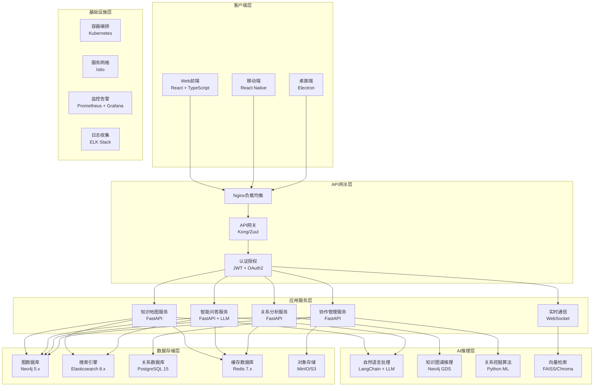

# EFIAgent知识地图 - 技术架构设计

## 1. 系统架构概览

### 1.1 整体架构图



### 1.2 技术栈选择

#### 前端技术栈
```json
{
  "framework": "React 18.2+",
  "language": "TypeScript 5.0+",
  "ui_library": "Ant Design 5.0+",
  "visualization": [
    "D3.js 7.0+",
    "Cytoscape.js 3.0+",
    "Three.js (3D可视化)"
  ],
  "state_management": "Redux Toolkit + RTK Query",
  "styling": "Styled Components + CSS Modules",
  "build_tool": "Vite 4.0+",
  "testing": "Jest + React Testing Library"
}
```

#### 后端技术栈
```json
{
  "framework": "FastAPI 0.104+",
  "language": "Python 3.11+",
  "ai_framework": [
    "LangChain 0.1+",
    "OpenAI API",
    "Transformers 4.35+"
  ],
  "graph_database": "Neo4j 5.15+",
  "search_engine": "Elasticsearch 8.11+",
  "relational_db": "PostgreSQL 15+",
  "cache": "Redis 7.2+",
  "message_queue": "RabbitMQ 3.12+",
  "web_socket": "FastAPI WebSocket",
  "async_tasks": "Celery + Redis"
}
```

## 2. 核心模块详细设计

### 2.1 知识地图服务

#### 2.1.1 服务架构

```python
# knowledge_map_service.py
from fastapi import FastAPI, Depends, WebSocket
from typing import List, Optional
import asyncio

class KnowledgeMapService:
    def __init__(self):
        self.neo4j_driver = Neo4jDriver()
        self.redis_client = RedisClient()
        self.event_bus = EventBus()

    async def get_knowledge_map(self,
                              center_node: Optional[str] = None,
                              depth: int = 2,
                              node_types: Optional[List[str]] = None,
                              relationship_types: Optional[List[str]] = None) -> GraphData:
        """获取知识地图数据"""

        # 1. 缓存检查
        cache_key = f"map:{center_node}:{depth}:{hash(str(node_types))}"
        cached_data = await self.redis_client.get(cache_key)
        if cached_data:
            return GraphData.parse_raw(cached_data)

        # 2. 图数据库查询
        query = self._build_map_query(center_node, depth, node_types, relationship_types)
        result = await self.neo4j_driver.execute_query(query)

        # 3. 数据处理和优化
        graph_data = self._process_graph_result(result)

        # 4. 布局计算
        layout_data = await self._calculate_layout(graph_data)

        # 5. 缓存结果
        await self.redis_client.setex(cache_key, 3600, layout_data.json())

        return layout_data

    async def search_entities(self,
                            query: str,
                            limit: int = 20,
                            offset: int = 0) -> SearchResult:
        """搜索实体"""

        # 1. 多源搜索
        es_results = await self._search_elasticsearch(query, limit, offset)
        neo4j_results = await self._search_neo4j(query, limit, offset)

        # 2. 结果合并和排序
        combined_results = self._combine_search_results(es_results, neo4j_results)

        # 3. 相关性评分
        scored_results = await self._calculate_relevance_score(combined_results, query)

        return SearchResult(
            entities=scored_results,
            total=len(scored_results),
            query=query
        )
```

#### 2.1.2 图数据库设计

**节点标签 (Node Labels):**
```cypher
// 业务概念节点
(:BusinessConcept {
  id: String,
  name: String,
  description: String,
  type: String,  // process, system, department, product, feature
  category: String,
  attributes: Map,
  metadata: Map,
  created_at: DateTime,
  updated_at: DateTime
})

// IT系统节点
(:ITSystem {
  id: String,
  name: String,
  description: String,
  system_type: String,  // web, mobile, api, database, service
  technology_stack: [String],
  owner: String,
  status: String,
  created_at: DateTime,
  updated_at: DateTime
})

// 组织架构节点
(:Organization {
  id: String,
  name: String,
  type: String,  // department, team, role
  level: Integer,
  parent_id: String,
  created_at: DateTime,
  updated_at: DateTime
})
```

**关系类型 (Relationship Types):**
```cypher
// 依赖关系
(:BusinessConcept)-[:DEPENDS_ON {
  strength: Float,  // 0.0-1.0
  description: String,
  created_at: DateTime
}]->(:BusinessConcept)

// 数据流关系
(:ITSystem)-[:DATA_FLOW {
  direction: String,  // bidirectional, unidirectional
  data_type: String,
  frequency: String,
  volume: String,
  created_at: DateTime
}]->(:ITSystem)

// 影响关系
(:BusinessConcept)-[:AFFECTS {
  impact_type: String,  // functional, technical, financial
  severity: String,  // high, medium, low
  probability: Float,
  created_at: DateTime
}]->(:BusinessConcept)

// 管理关系
(:Organization)-[:MANAGES {
  scope: String,
  responsibilities: [String],
  created_at: DateTime
}]->(:ITSystem)
```

#### 2.1.3 查询优化策略

```python
class QueryOptimizer:
    def __init__(self):
        self.query_cache = {}
        self.index_hints = {
            "name_search": "entity_name_index",
            "type_filter": "entity_type_index",
            "relationship_lookup": "relationship_composite_index"
        }

    async def optimize_query(self,
                           base_query: str,
                           parameters: dict) -> str:
        """优化Cypher查询"""

        # 1. 查询模式分析
        query_pattern = self._analyze_query_pattern(base_query)

        # 2. 索引提示添加
        optimized_query = self._add_index_hints(base_query, query_pattern)

        # 3. 参数化处理
        parameterized_query = self._parameterize_query(optimized_query)

        # 4. 查询计划缓存
        query_hash = hash(parameterized_query)
        if query_hash not in self.query_cache:
            self.query_cache[query_hash] = parameterized_query

        return self.query_cache[query_hash]

    def _analyze_query_pattern(self, query: str) -> dict:
        """分析查询模式"""
        return {
            "has_name_filter": "name" in query,
            "has_type_filter": "type" in query,
            "has_relationship_filter": "MATCH" in query and "-" in query,
            "has_aggregation": "COUNT(" in query or "SUM(" in query,
            "depth": query.count("-")
        }
```

### 2.2 智能问答服务

#### 2.2.1 服务架构

```python
# intelligent_qa_service.py
from langchain.chains import LLMChain
from langchain.prompts import PromptTemplate
from langchain.llms import OpenAI

class IntelligentQAService:
    def __init__(self):
        self.llm = OpenAI(model="gpt-4", temperature=0.1)
        self.neo4j_service = Neo4jService()
        self.es_service = ElasticsearchService()
        self.intent_classifier = IntentClassifier()
        self.entity_extractor = EntityExtractor()

    async def answer_question(self, question: str, user_id: str) -> Answer:
        """智能问答主流程"""

        try:
            # 1. 意图识别
            intent = await self.intent_classifier.classify(question)

            # 2. 实体提取
            entities = await self.entity_extractor.extract(question)

            # 3. 根据意图选择处理策略
            if intent.type == "relationship_query":
                answer = await self._handle_relationship_query(question, entities)
            elif intent.type == "path_finding":
                answer = await self._handle_path_finding(question, entities)
            elif intent.type == "impact_analysis":
                answer = await self._handle_impact_analysis(question, entities)
            else:
                answer = await self._handle_general_query(question, entities)

            # 4. 记录查询日志
            await self._log_query(question, answer, user_id, intent)

            return answer

        except Exception as e:
            return Answer(
                text=f"抱歉，我无法回答这个问题: {str(e)}",
                confidence=0.0,
                sources=[],
                visualizations=[]
            )

    async def _handle_relationship_query(self,
                                       question: str,
                                       entities: List[Entity]) -> Answer:
        """处理关系查询"""

        # 1. 构建图数据库查询
        cypher_query = self._build_relationship_query(entities)
        graph_results = await self.neo4j_service.execute_query(cypher_query)

        # 2. 检索相关知识文档
        kb_results = await self.es_service.search(question, limit=5)

        # 3. 生成答案
        prompt_template = PromptTemplate(
            input_variables=["question", "graph_data", "knowledge_base"],
            template="""基于以下信息回答用户问题：

问题: {question}

图数据库信息:
{graph_data}

相关知识库信息:
{knowledge_base}

请提供一个准确、清晰的答案，并引用相关的信息来源。"""
        )

        chain = LLMChain(llm=self.llm, prompt=prompt_template)
        answer_text = await chain.arun(
            question=question,
            graph_data=self._format_graph_data(graph_results),
            knowledge_base=self._format_kb_data(kb_results)
        )

        # 4. 生成可视化数据
        visualizations = await self._generate_visualizations(graph_results)

        return Answer(
            text=answer_text,
            confidence=self._calculate_confidence(graph_results, kb_results),
            sources=self._extract_sources(kb_results),
            visualizations=visualizations,
            graph_data=graph_results
        )
```

#### 2.2.2 LLM集成策略

```python
class LLMIntegration:
    def __init__(self):
        self.models = {
            "gpt-4": OpenAI(model="gpt-4", temperature=0.1),
            "gpt-3.5-turbo": OpenAI(model="gpt-3.5-turbo", temperature=0.2),
            "local-model": LocalLLM(model_path="./models/llama-2-7b")
        }
        self.router = ModelRouter()

    async def route_request(self,
                          request_type: str,
                          complexity: str,
                          urgency: str) -> LLM:
        """智能路由到最适合的模型"""

        if urgency == "high" and complexity == "simple":
            return self.models["gpt-3.5-turbo"]
        elif complexity == "complex":
            return self.models["gpt-4"]
        else:
            return self.models["local-model"]

    async def generate_with_fallback(self,
                                   prompt: str,
                                   max_retries: int = 3) -> str:
        """带降级的生成策略"""

        for attempt in range(max_retries):
            try:
                model = await self.router.get_best_model()
                result = await model.agenerate(prompt)

                # 质量检查
                if self._validate_response_quality(result):
                    return result

            except Exception as e:
                if attempt == max_retries - 1:
                    raise e
                await asyncio.sleep(2 ** attempt)  # 指数退避

        return "抱歉，暂时无法生成回答。"
```

### 2.3 实时协作服务

#### 2.3.1 WebSocket架构

```python
# collaboration_service.py
from fastapi import WebSocket, WebSocketDisconnect
import json
from typing import Dict, Set
import asyncio

class CollaborationService:
    def __init__(self):
        self.active_connections: Dict[str, Set[WebSocket]] = {}
        self.user_sessions: Dict[WebSocket, str] = {}
        self.edit_locks: Dict[str, str] = {}  # entity_id -> user_id
        self.event_queue = asyncio.Queue()

    async def connect(self, websocket: WebSocket, user_id: str, entity_id: str):
        """建立WebSocket连接"""
        await websocket.accept()

        # 1. 记录连接
        if entity_id not in self.active_connections:
            self.active_connections[entity_id] = set()
        self.active_connections[entity_id].add(websocket)
        self.user_sessions[websocket] = user_id

        # 2. 发送初始状态
        await self._send_initial_state(websocket, entity_id)

        # 3. 通知其他用户
        await self._broadcast_user_join(entity_id, user_id)

    async def handle_edit_event(self,
                              websocket: WebSocket,
                              event: EditEvent):
        """处理编辑事件"""

        user_id = self.user_sessions[websocket]
        entity_id = event.entity_id

        # 1. 权限检查
        if not await self._check_edit_permission(user_id, entity_id):
            await websocket.send_json({"type": "error", "message": "无编辑权限"})
            return

        # 2. 冲突检测
        if entity_id in self.edit_locks and self.edit_locks[entity_id] != user_id:
            await websocket.send_json({"type": "lock_error", "owner": self.edit_locks[entity_id]})
            return

        # 3. 获取编辑锁
        self.edit_locks[entity_id] = user_id

        try:
            # 4. 应用编辑
            await self._apply_edit(event)

            # 5. 广播变更
            await self._broadcast_edit(entity_id, event, user_id)

        finally:
            # 6. 释放编辑锁
            del self.edit_locks[entity_id]

    async def handle_cursor_movement(self,
                                   websocket: WebSocket,
                                   cursor_event: CursorEvent):
        """处理光标移动事件"""

        user_id = self.user_sessions[websocket]
        entity_id = cursor_event.entity_id

        # 广播光标位置给其他用户
        await self._broadcast_cursor_position(entity_id, cursor_event, user_id)

    async def disconnect(self, websocket: WebSocket):
        """断开WebSocket连接"""

        if websocket in self.user_sessions:
            user_id = self.user_sessions[websocket]

            # 1. 清理编辑锁
            locks_to_remove = [
                entity_id for entity_id, lock_user in self.edit_locks.items()
                if lock_user == user_id
            ]
            for entity_id in locks_to_remove:
                del self.edit_locks[entity_id]

            # 2. 从连接列表中移除
            for entity_id, connections in self.active_connections.items():
                if websocket in connections:
                    connections.remove(websocket)
                    # 通知其他用户
                    await self._broadcast_user_leave(entity_id, user_id)

            # 3. 清理会话
            del self.user_sessions[websocket]
```

#### 2.3.2 冲突解决机制

```python
class ConflictResolver:
    def __init__(self):
        self.edit_history = EditHistory()
        self.merge_algorithm = ThreeWayMerge()

    async def resolve_conflict(self,
                             current_content: str,
                             incoming_edit: EditEvent,
                             concurrent_edits: List[EditEvent]) -> ConflictResolution:
        """解决编辑冲突"""

        # 1. 分析冲突类型
        conflict_type = self._analyze_conflict_type(current_content, incoming_edit, concurrent_edits)

        if conflict_type == "no_conflict":
            return ConflictResolution(
                type="auto_merge",
                merged_content=self._apply_edit(current_content, incoming_edit),
                requires_manual_resolution=False
            )

        elif conflict_type == "structural_conflict":
            # 2. 尝试自动合并
            merge_result = await self._attempt_auto_merge(current_content, incoming_edit, concurrent_edits)

            if merge_result.success:
                return ConflictResolution(
                    type="auto_merge",
                    merged_content=merge_result.content,
                    requires_manual_resolution=False
                )
            else:
                return ConflictResolution(
                    type="manual_resolution_required",
                    conflicting_edits=concurrent_edits + [incoming_edit],
                    requires_manual_resolution=True
                )

        elif conflict_type == "semantic_conflict":
            return ConflictResolution(
                type="semantic_conflict",
                description="检测到语义冲突，需要人工确认",
                conflicting_edits=concurrent_edits + [incoming_edit],
                requires_manual_resolution=True
            )

    def _analyze_conflict_type(self,
                             base_content: str,
                             incoming_edit: EditEvent,
                             concurrent_edits: List[EditEvent]) -> str:
        """分析冲突类型"""

        # 检查是否有重叠的编辑区域
        incoming_range = (incoming_edit.start_position, incoming_edit.end_position)

        for edit in concurrent_edits:
            edit_range = (edit.start_position, edit.end_position)

            if self._ranges_overlap(incoming_range, edit_range):
                if incoming_edit.type == "delete" and edit.type == "delete":
                    return "structural_conflict"
                elif incoming_edit.type != edit.type:
                    return "semantic_conflict"
                else:
                    return "structural_conflict"

        return "no_conflict"
```

## 3. 数据层设计

### 3.1 图数据库设计 (Neo4j)

#### 3.1.1 索引策略

```cypher
-- 创建复合索引
CREATE INDEX entity_name_type_index FOR (e:Entity) ON (e.name, e.type);
CREATE INDEX entity_category_index FOR (e:Entity) ON (e.category);
CREATE INDEX system_owner_index FOR (s:ITSystem) ON (s.owner);
CREATE INDEX relationship_composite_index FOR ()-[r:DEPENDS_ON]-() ON (r.strength, r.created_at);

-- 创建全文搜索索引
CREATE FULLTEXT INDEX entity_fulltext_index FOR (e:Entity) ON EACH [e.name, e.description];
CREATE FULLTEXT INDEX system_fulltext_index FOR (s:ITSystem) ON EACH [s.name, s.description];

-- 创建空间索引（如果需要地理位置）
CREATE POINT INDEX entity_location_index FOR (e:Entity) ON (e.location);
```

#### 3.1.2 数据分片策略

```python
class Neo4jShardingStrategy:
    def __init__(self):
        self.shard_count = 4
        self.shard_mapping = {
            "business_concept": 0,
            "it_system": 1,
            "organization": 2,
            "process": 3
        }

    def get_shard_for_entity(self, entity_type: str, entity_id: str) -> int:
        """确定实体应该存储在哪个分片"""

        base_shard = self.shard_mapping.get(entity_type, 0)
        hash_value = hash(entity_id)
        return (base_shard + hash_value) % self.shard_count

    async def route_query(self, cypher_query: str, parameters: dict) -> List[Any]:
        """路由查询到相应的分片"""

        # 分析查询涉及的实体类型
        entity_types = self._extract_entity_types(cypher_query)

        if len(entity_types) == 1:
            # 单分片查询
            shard_id = self.shard_mapping.get(entity_types[0], 0)
            return await self._execute_on_shard(shard_id, cypher_query, parameters)
        else:
            # 跨分片查询
            return await self._execute_cross_shard(cypher_query, parameters, entity_types)
```

### 3.2 搜索引擎设计 (Elasticsearch)

#### 3.2.1 索引结构

```json
{
  "mappings": {
    "properties": {
      "entity_id": {
        "type": "keyword"
      },
      "name": {
        "type": "text",
        "analyzer": "ik_max_word",
        "search_analyzer": "ik_smart",
        "fields": {
          "keyword": {
            "type": "keyword"
          },
          "suggest": {
            "type": "completion"
          }
        }
      },
      "description": {
        "type": "text",
        "analyzer": "ik_max_word"
      },
      "type": {
        "type": "keyword"
      },
      "category": {
        "type": "keyword"
      },
      "attributes": {
        "type": "object",
        "dynamic": true
      },
      "relationships": {
        "type": "nested",
        "properties": {
          "target_entity": {
            "type": "keyword"
          },
          "relationship_type": {
            "type": "keyword"
          },
          "strength": {
            "type": "float"
          }
        }
      },
      "tags": {
        "type": "keyword"
      },
      "created_at": {
        "type": "date"
      },
      "updated_at": {
        "type": "date"
      },
      "popularity_score": {
        "type": "float"
      }
    }
  },
  "settings": {
    "number_of_shards": 3,
    "number_of_replicas": 1,
    "analysis": {
      "analyzer": {
        "ik_max_word": {
          "type": "ik_max_word"
        },
        "ik_smart": {
          "type": "ik_smart"
        }
      }
    }
  }
}
```

#### 3.2.2 搜索优化策略

```python
class ElasticsearchOptimizer:
    def __init__(self):
        self.es_client = ElasticsearchClient()
        self.query_templates = self._load_query_templates()
        self.search_cache = TTLCache(maxsize=1000, ttl=300)  # 5分钟缓存

    async def optimized_search(self,
                             query: str,
                             filters: dict = None,
                             sort: list = None,
                             size: int = 20,
                             from_: int = 0) -> SearchResult:
        """优化的搜索实现"""

        # 1. 缓存检查
        cache_key = f"{hash(query)}:{hash(str(filters))}:{size}:{from_}"
        if cache_key in self.search_cache:
            return self.search_cache[cache_key]

        # 2. 查询优化
        optimized_query = await self._optimize_query(query, filters)

        # 3. 执行搜索
        search_result = await self.es_client.search(
            index="knowledge_entities",
            body={
                "query": optimized_query,
                "sort": sort or [{"popularity_score": {"order": "desc"}}, "_score"],
                "size": size,
                "from": from_,
                "highlight": {
                    "fields": {
                        "name": {},
                        "description": {}
                    }
                }
            }
        )

        # 4. 结果处理
        processed_result = self._process_search_result(search_result)

        # 5. 缓存结果
        self.search_cache[cache_key] = processed_result

        return processed_result

    async def _optimize_query(self, query: str, filters: dict = None) -> dict:
        """优化搜索查询"""

        # 1. 意图识别
        intent = await self._classify_search_intent(query)

        # 2. 查询构建
        if intent == "exact_match":
            base_query = {
                "term": {
                    "name.keyword": query
                }
            }
        elif intent == "fuzzy_match":
            base_query = {
                "multi_match": {
                    "query": query,
                    "fields": ["name^3", "description^2", "attributes.*"],
                    "fuzziness": "AUTO",
                    "prefix_length": 2
                }
            }
        else:
            base_query = {
                "bool": {
                    "should": [
                        {
                            "multi_match": {
                                "query": query,
                                "fields": ["name^3", "description^2"],
                                "type": "best_fields"
                            }
                        },
                        {
                            "match_phrase": {
                                "description": {
                                    "query": query,
                                    "boost": 2.0
                                }
                            }
                        },
                        {
                            "wildcard": {
                                "name": {
                                    "value": f"*{query}*",
                                    "boost": 0.5
                                }
                            }
                        }
                    ]
                }
            }

        # 3. 添加过滤条件
        if filters:
            base_query = {
                "bool": {
                    "must": [base_query],
                    "filter": self._build_filters(filters)
                }
            }

        return base_query
```

### 3.3 缓存策略设计

#### 3.3.1 多级缓存架构

```python
class MultiLevelCache:
    def __init__(self):
        # L1: 内存缓存 (应用本地)
        self.l1_cache = TTLCache(maxsize=1000, ttl=60)  # 1分钟

        # L2: Redis缓存 (分布式)
        self.l2_cache = RedisCache(
            host="redis-cluster",
            port=6379,
            ttl=3600  # 1小时
        )

        # L3: 数据库缓存 (查询结果缓存)
        self.l3_cache = DatabaseCache()

    async def get(self, key: str) -> Optional[Any]:
        """多级缓存获取"""

        # L1 缓存查找
        if key in self.l1_cache:
            return self.l1_cache[key]

        # L2 缓存查找
        l2_result = await self.l2_cache.get(key)
        if l2_result is not None:
            # 回写L1缓存
            self.l1_cache[key] = l2_result
            return l2_result

        # L3 缓存查找
        l3_result = await self.l3_cache.get(key)
        if l3_result is not None:
            # 回写L2和L1缓存
            await self.l2_cache.set(key, l3_result)
            self.l1_cache[key] = l3_result
            return l3_result

        return None

    async def set(self, key: str, value: Any, ttl: int = None):
        """多级缓存设置"""

        # 写入所有层级
        self.l1_cache[key] = value
        await self.l2_cache.set(key, value, ttl)
        await self.l3_cache.set(key, value, ttl)

    async def invalidate(self, key_pattern: str):
        """缓存失效"""

        # L1 缓存失效
        keys_to_remove = [k for k in self.l1_cache.keys() if key_pattern in k]
        for key in keys_to_remove:
            del self.l1_cache[key]

        # L2 缓存失效
        await self.l2_cache.delete_pattern(key_pattern)

        # L3 缓存失效
        await self.l3_cache.delete_pattern(key_pattern)
```

## 4. 部署架构设计

### 4.1 容器化部署

#### 4.1.1 Docker配置

```dockerfile
# Dockerfile.frontend
FROM node:18-alpine AS builder
WORKDIR /app
COPY package*.json ./
RUN npm ci --only=production
COPY . .
RUN npm run build

FROM nginx:alpine
COPY --from=builder /app/dist /usr/share/nginx/html
COPY nginx.conf /etc/nginx/nginx.conf
EXPOSE 80
CMD ["nginx", "-g", "daemon off;"]
```

```dockerfile
# Dockerfile.backend
FROM python:3.11-slim
WORKDIR /app

# 安装系统依赖
RUN apt-get update && apt-get install -y \
    gcc \
    g++ \
    && rm -rf /var/lib/apt/lists/*

# 安装Python依赖
COPY requirements.txt .
RUN pip install --no-cache-dir -r requirements.txt

# 复制应用代码
COPY . .

# 创建非root用户
RUN useradd --create-home --shell /bin/bash app \
    && chown -R app:app /app
USER app

EXPOSE 8000
CMD ["uvicorn", "main:app", "--host", "0.0.0.0", "--port", "8000"]
```

#### 4.1.2 Kubernetes部署配置

```yaml
# deployment.yaml
apiVersion: apps/v1
kind: Deployment
metadata:
  name: knowledge-map-api
  labels:
    app: knowledge-map
    component: api
spec:
  replicas: 3
  selector:
    matchLabels:
      app: knowledge-map
      component: api
  template:
    metadata:
      labels:
        app: knowledge-map
        component: api
    spec:
      containers:
      - name: api
        image: efiagent/knowledge-map-api:latest
        ports:
        - containerPort: 8000
        env:
        - name: DATABASE_URL
          valueFrom:
            secretKeyRef:
              name: db-secrets
              key: url
        - name: REDIS_URL
          valueFrom:
            configMapKeyRef:
              name: app-config
              key: redis-url
        resources:
          requests:
            memory: "256Mi"
            cpu: "250m"
          limits:
            memory: "512Mi"
            cpu: "500m"
        livenessProbe:
          httpGet:
            path: /health
            port: 8000
          initialDelaySeconds: 30
          periodSeconds: 10
        readinessProbe:
          httpGet:
            path: /ready
            port: 8000
          initialDelaySeconds: 5
          periodSeconds: 5
---
apiVersion: v1
kind: Service
metadata:
  name: knowledge-map-api-service
spec:
  selector:
    app: knowledge-map
    component: api
  ports:
  - protocol: TCP
    port: 80
    targetPort: 8000
  type: ClusterIP
```

### 4.2 监控与日志

#### 4.2.1 Prometheus监控配置

```yaml
# monitoring.yaml
apiVersion: v1
kind: ConfigMap
metadata:
  name: prometheus-config
data:
  prometheus.yml: |
    global:
      scrape_interval: 15s
      evaluation_interval: 15s

    rule_files:
      - "/etc/prometheus/rules/*.yml"

    scrape_configs:
      - job_name: 'knowledge-map-api'
        static_configs:
          - targets: ['knowledge-map-api-service:80']
        metrics_path: /metrics
        scrape_interval: 30s

      - job_name: 'neo4j'
        static_configs:
          - targets: ['neo4j:2004']

      - job_name: 'elasticsearch'
        static_configs:
          - targets: ['elasticsearch:9200']

      - job_name: 'redis'
        static_configs:
          - targets: ['redis:6379']
```

#### 4.2.2 日志收集配置

```yaml
# logging.yaml
apiVersion: v1
kind: ConfigMap
metadata:
  name: fluentd-config
data:
  fluent.conf: |
    <source>
      @type tail
      path /var/log/containers/*knowledge-map*.log
      pos_file /var/log/fluentd-containers.log.pos
      tag kubernetes.*
      read_from_head true
      <parse>
        @type json
        time_format %Y-%m-%dT%H:%M:%S.%NZ
      </parse>
    </source>

    <filter kubernetes.**>
      @type kubernetes_metadata
    </filter>

    <match kubernetes.**>
      @type elasticsearch
      host elasticsearch
      port 9200
      index_name knowledge-map-logs
      type_name _doc
      <buffer>
        @type file
        path /var/log/fluentd-buffers/kubernetes.system.buffer
        flush_mode interval
        retry_type exponential_backoff
        flush_thread_count 2
        flush_interval 5s
        retry_forever
        retry_max_interval 30
        chunk_limit_size 2M
        queue_limit_length 8
        overflow_action block
      </buffer>
    </match>
```

这个技术架构设计为EFIAgent知识地图提供了完整、可扩展、高性能的技术实现方案，确保系统能够稳定运行并支持大规模用户使用。