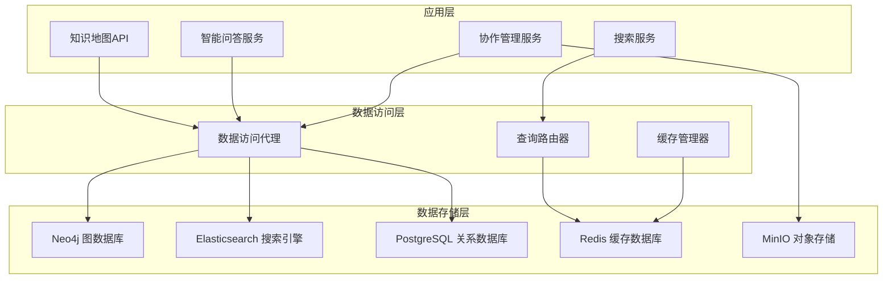

# EFIAgent知识地图 - 数据库设计方案

## 1. 数据存储架构概览

### 1.1 存储架构图



### 1.2 数据库选择理由

| 数据库 | 用途 | 选择理由 |
|--------|------|----------|
| Neo4j | 知识图谱存储 | 专业的图数据库，支持复杂的图查询和图算法 |
| Elasticsearch | 全文搜索 | 强大的全文搜索和分析能力，支持复杂查询 |
| PostgreSQL | 关系数据 | ACID事务支持，适合用户、权限等结构化数据 |
| Redis | 缓存与会话 | 高性能内存数据库，适合缓存和实时数据 |
| MinIO | 文件存储 | S3兼容的对象存储，适合文档和媒体文件 |

## 2. Neo4j图数据库设计

### 2.1 节点模型设计

#### 2.1.1 核心实体节点

```cypher
// 业务概念节点
CREATE CONSTRAINT entity_id_unique IF NOT EXISTS FOR (e:Entity) REQUIRE e.id IS UNIQUE;
CREATE INDEX entity_type_index IF NOT EXISTS FOR (e:Entity) ON (e.type);
CREATE INDEX entity_category_index IF NOT EXISTS FOR (e:Entity) ON (e.category);
CREATE INDEX entity_name_index IF NOT EXISTS FOR (e:Entity) ON (e.name);
CREATE FULLTEXT INDEX entity_fulltext_index IF NOT EXISTS FOR (e:Entity) ON EACH [e.name, e.description];

(:Entity {
  id: String,                    // 唯一标识符
  name: String,                  // 实体名称
  type: String,                  // 实体类型 (business_process, it_system, department, product, feature)
  category: String,              // 实体分类
  description: String,           // 描述
  attributes: Map,               // 自定义属性
  metadata: Map,                 // 元数据
  tags: [String],                // 标签
  status: String,                // 状态 (active, inactive, deprecated)
  priority: Integer,             // 优先级 (1-10)
  created_by: String,            // 创建者
  created_at: DateTime,          // 创建时间
  updated_by: String,            // 更新者
  updated_at: DateTime,          // 更新时间
  version: Integer               // 版本号
})

// IT系统节点
(:ITSystem {
  id: String,
  name: String,
  system_type: String,           // web, mobile, api, database, service, microservice
  technology_stack: [String],    // 技术栈
  owner: String,                 // 负责人/团队
  status: String,                // running, maintenance, deprecated
  environment: String,           // development, staging, production
  url: String,                   // 系统URL
  api_documentation: String,     // API文档URL
  monitoring_dashboard: String,  // 监控面板URL
  created_at: DateTime,
  updated_at: DateTime
})

// 组织架构节点
(:Organization {
  id: String,
  name: String,
  type: String,                  // department, team, role, position
  level: Integer,                // 组织层级
  parent_id: String,             // 上级组织ID
  manager: String,               // 负责人
  contact_email: String,         // 联系邮箱
  member_count: Integer,         // 成员数量
  created_at: DateTime,
  updated_at: DateTime
})

// 用户节点
(:User {
  id: String,
  username: String,
  email: String,
  display_name: String,
  avatar: String,
  role: String,                  // admin, analyst, architect, viewer
  department: String,
  status: String,                // active, inactive, suspended
  last_login: DateTime,
  created_at: DateTime,
  updated_at: DateTime
})

// 文档节点
(:Document {
  id: String,
  title: String,
  content_type: String,          // specification, manual, guide, report
  file_url: String,
  file_size: Long,
  file_type: String,
  entity_id: String,             // 关联的实体ID
  version: String,
  uploaded_by: String,
  uploaded_at: DateTime
})
```

#### 2.1.2 节点继承关系

```cypher
// 业务概念是Entity的子类型
(:BusinessProcess)-[:SUBTYPE_OF]->(:Entity)
(:ITSystem)-[:SUBTYPE_OF]->(:Entity)
(:Department)-[:SUBTYPE_OF]->(:Entity)
(:Product)-[:SUBTYPE_OF]->(:Entity)
(:Feature)-[:SUBTYPE_OF]->(:Entity)
```

### 2.2 关系模型设计

#### 2.2.1 依赖关系

```cypher
CREATE INDEX relationship_strength_index IF NOT EXISTS FOR ()-[r:DEPENDS_ON]-() ON (r.strength);
CREATE INDEX relationship_created_at_index IF NOT EXISTS FOR ()-[r]-() ON (r.created_at);

// 依赖关系
(:Entity)-[:DEPENDS_ON {
  strength: Float,               // 依赖强度 0.0-1.0
  dependency_type: String,       // functional, technical, data, operational
  criticality: String,           // high, medium, low
  description: String,
  conditions: [String],          // 依赖条件
  created_by: String,
  created_at: DateTime,
  updated_at: DateTime
}]->(:Entity)

// 触发关系
(:Entity)-[:TRIGGERS {
  trigger_type: String,          // event, condition, schedule
  trigger_conditions: [String],
  delay: Integer,                // 延迟时间(秒)
  created_at: DateTime
}]->(:Entity)

// 包含关系
(:Entity)-[:CONTAINS {
  containment_type: String,      // composition, aggregation, reference
  cardinality: String,           // one-to-one, one-to-many, many-to-many
  optional: Boolean,
  created_at: DateTime
}]->(:Entity)

// 影响关系
(:Entity)-[:AFFECTS {
  impact_type: String,           // functional, technical, financial, operational
  impact_direction: String,      // positive, negative, neutral
  severity: String,              // critical, high, medium, low
  probability: Float,            // 影响概率 0.0-1.0
  mitigation: String,            // 缓解措施
  created_at: DateTime
}]->(:Entity)
```

#### 2.2.2 数据流关系

```cypher
// 数据流关系
(:ITSystem)-[:DATA_FLOW {
  direction: String,             // bidirectional, unidirectional
  data_type: String,             // json, xml, csv, binary
  data_format: String,           // rest_api, message_queue, database
  frequency: String,             // real-time, batch, scheduled
  volume: String,                // low, medium, high
  latency: String,               // low, medium, high
  protocol: String,              // http, https, tcp, udp
  authentication: String,        // oauth, jwt, basic, none
  encryption: Boolean,
  created_at: DateTime
}]->(:ITSystem)

// API调用关系
(:ITSystem)-[:API_CALL {
  method: String,                // GET, POST, PUT, DELETE
  endpoint: String,
  version: String,
  rate_limit: Integer,
  timeout: Integer,              // 超时时间(毫秒)
  retry_policy: String,
  created_at: DateTime
}]->(:ITSystem)
```

#### 2.2.3 管理关系

```cypher
// 管理关系
(:Organization)-[:MANAGES {
  management_type: String,       // direct, indirect, functional
  scope: String,                 // full, partial, advisory
  responsibilities: [String],
  authority_level: Integer,      // 1-10
  created_at: DateTime
}]->(:ITSystem)

(:Organization)-[:MANAGES {
  management_type: String,
  responsibilities: [String],
  created_at: DateTime
}]->(:Entity)

// 权限关系
(:User)-[:HAS_PERMISSION {
  permission_type: String,       // read, write, delete, share, admin
  scope: String,                 // entity, relationship, system
  granted_by: String,
  granted_at: DateTime,
  expires_at: DateTime
}]->(:Entity)

// 协作关系
(:User)-[:COLLABORATES_ON {
  role: String,                  // owner, editor, viewer, reviewer
  joined_at: DateTime,
  last_activity: DateTime,
  contribution_count: Integer,
  created_at: DateTime
}]->(:Entity)
```

### 2.3 图数据库查询优化

#### 2.3.1 索引策略

```cypher
-- 创建复合索引
CREATE INDEX entity_composite_index IF NOT EXISTS FOR (e:Entity) ON (e.type, e.category, e.status);

-- 创建范围索引
CREATE INDEX entity_priority_index IF NOT EXISTS FOR (e:Entity) ON (e.priority);
CREATE INDEX entity_created_at_index IF NOT EXISTS FOR (e:Entity) ON (e.created_at);

-- 创建关系索引
CREATE INDEX depends_on_strength_index IF NOT EXISTS FOR ()-[r:DEPENDS_ON]-() ON (r.strength, r.criticality);
CREATE INDEX data_flow_frequency_index IF NOT EXISTS FOR ()-[r:DATA_FLOW]-() ON (r.frequency, r.volume);
```

#### 2.3.2 查询优化示例

```cypher
-- 优化前：全表扫描
MATCH (e:Entity) WHERE e.name CONTAINS '销售' RETURN e;

-- 优化后：使用全文索引
CALL db.index.fulltext.queryNodes("entity_fulltext_index", "销售") YIELD node, score
RETURN node, score
ORDER BY score DESC
LIMIT 20;

-- 复杂关系查询优化
MATCH path = (start:Entity {id: $start_id})-[:DEPENDS_ON*1..3]->(end:Entity {id: $end_id})
WHERE ALL(r IN relationships(path) WHERE r.strength > 0.5)
RETURN path, reduce(weight = 1.0, r IN relationships(path) | weight * r.strength) AS total_weight
ORDER BY total_weight DESC
LIMIT 5;
```

## 3. Elasticsearch搜索引擎设计

### 3.1 索引结构设计

#### 3.1.1 实体索引

```json
{
  "mappings": {
    "properties": {
      "entity_id": {
        "type": "keyword"
      },
      "name": {
        "type": "text",
        "analyzer": "ik_max_word",
        "search_analyzer": "ik_smart",
        "fields": {
          "keyword": {
            "type": "keyword"
          },
          "suggest": {
            "type": "completion",
            "analyzer": "ik_smart"
          }
        }
      },
      "description": {
        "type": "text",
        "analyzer": "ik_max_word",
        "search_analyzer": "ik_smart"
      },
      "type": {
        "type": "keyword"
      },
      "category": {
        "type": "keyword"
      },
      "status": {
        "type": "keyword"
      },
      "priority": {
        "type": "integer"
      },
      "tags": {
        "type": "keyword"
      },
      "attributes": {
        "type": "object",
        "dynamic": true
      },
      "relationships": {
        "type": "nested",
        "properties": {
          "target_entity": {
            "type": "keyword"
          },
          "relationship_type": {
            "type": "keyword"
          },
          "strength": {
            "type": "float"
          },
          "description": {
            "type": "text",
            "analyzer": "ik_max_word"
          }
        }
      },
      "created_by": {
        "type": "keyword"
      },
      "created_at": {
        "type": "date"
      },
      "updated_at": {
        "type": "date"
      },
      "popularity_score": {
        "type": "float"
      },
      "view_count": {
        "type": "integer"
      },
      "collaboration_count": {
        "type": "integer"
      }
    }
  },
  "settings": {
    "number_of_shards": 3,
    "number_of_replicas": 1,
    "analysis": {
      "analyzer": {
        "ik_max_word": {
          "type": "ik_max_word"
        },
        "ik_smart": {
          "type": "ik_smart"
        }
      }
    }
  }
}
```

#### 3.1.2 文档索引

```json
{
  "mappings": {
    "properties": {
      "document_id": {
        "type": "keyword"
      },
      "title": {
        "type": "text",
        "analyzer": "ik_max_word",
        "fields": {
          "keyword": {
            "type": "keyword"
          }
        }
      },
      "content": {
        "type": "text",
        "analyzer": "ik_max_word"
      },
      "entity_id": {
        "type": "keyword"
      },
      "content_type": {
        "type": "keyword"
      },
      "file_type": {
        "type": "keyword"
      },
      "file_size": {
        "type": "long"
      },
      "uploaded_by": {
        "type": "keyword"
      },
      "uploaded_at": {
        "type": "date"
      }
    }
  }
}
```

### 3.2 搜索查询优化

#### 3.2.1 多字段搜索

```json
{
  "query": {
    "bool": {
      "should": [
        {
          "multi_match": {
            "query": "销售订单处理系统",
            "fields": [
              "name^3",
              "description^2",
              "attributes.*",
              "relationships.description"
            ],
            "type": "best_fields",
            "fuzziness": "AUTO"
          }
        },
        {
          "match_phrase": {
            "name": {
              "query": "销售订单",
              "boost": 2.0
            }
          }
        },
        {
          "nested": {
            "path": "relationships",
            "query": {
              "match": {
                "relationships.description": "系统依赖"
              }
            },
            "boost": 1.5
          }
        }
      ],
      "filter": [
        {
          "term": {
            "status": "active"
          }
        }
      ]
    }
  },
  "highlight": {
    "fields": {
      "name": {},
      "description": {
        "fragment_size": 150,
        "number_of_fragments": 3
      }
    }
  },
  "sort": [
    {
      "_score": {
        "order": "desc"
      }
    },
    {
      "popularity_score": {
        "order": "desc"
      }
    }
  ]
}
```

#### 3.2.2 聚合搜索

```json
{
  "query": {
    "match_all": {}
  },
  "aggs": {
    "type_distribution": {
      "terms": {
        "field": "type",
        "size": 10
      }
    },
    "category_distribution": {
      "terms": {
        "field": "category",
        "size": 20
      }
    },
    "priority_distribution": {
      "histogram": {
        "field": "priority",
        "interval": 1
      }
    },
    "created_timeline": {
      "date_histogram": {
        "field": "created_at",
        "calendar_interval": "month"
      }
    }
  }
}
```

## 4. PostgreSQL关系数据库设计

### 4.1 用户管理表

#### 4.1.1 用户表

```sql
CREATE TABLE users (
    id VARCHAR(36) PRIMARY KEY DEFAULT gen_random_uuid(),
    username VARCHAR(50) UNIQUE NOT NULL,
    email VARCHAR(255) UNIQUE NOT NULL,
    password_hash VARCHAR(255) NOT NULL,
    display_name VARCHAR(100) NOT NULL,
    avatar_url VARCHAR(500),
    role VARCHAR(20) NOT NULL DEFAULT 'viewer',
    department VARCHAR(100),
    status VARCHAR(20) NOT NULL DEFAULT 'active',
    email_verified BOOLEAN DEFAULT FALSE,
    last_login_at TIMESTAMP WITH TIME ZONE,
    password_changed_at TIMESTAMP WITH TIME ZONE DEFAULT CURRENT_TIMESTAMP,
    failed_login_attempts INTEGER DEFAULT 0,
    locked_until TIMESTAMP WITH TIME ZONE,
    created_at TIMESTAMP WITH TIME ZONE DEFAULT CURRENT_TIMESTAMP,
    updated_at TIMESTAMP WITH TIME ZONE DEFAULT CURRENT_TIMESTAMP
);

-- 索引
CREATE INDEX idx_users_email ON users(email);
CREATE INDEX idx_users_username ON users(username);
CREATE INDEX idx_users_role ON users(role);
CREATE INDEX idx_users_status ON users(status);
CREATE INDEX idx_users_last_login ON users(last_login_at);
```

#### 4.1.2 用户会话表

```sql
CREATE TABLE user_sessions (
    id VARCHAR(36) PRIMARY KEY DEFAULT gen_random_uuid(),
    user_id VARCHAR(36) NOT NULL REFERENCES users(id) ON DELETE CASCADE,
    session_token VARCHAR(255) UNIQUE NOT NULL,
    refresh_token VARCHAR(255) UNIQUE,
    device_info JSONB,
    ip_address INET,
    user_agent TEXT,
    expires_at TIMESTAMP WITH TIME ZONE NOT NULL,
    created_at TIMESTAMP WITH TIME ZONE DEFAULT CURRENT_TIMESTAMP,
    last_used_at TIMESTAMP WITH TIME ZONE DEFAULT CURRENT_TIMESTAMP
);

-- 索引
CREATE INDEX idx_sessions_user_id ON user_sessions(user_id);
CREATE INDEX idx_sessions_token ON user_sessions(session_token);
CREATE INDEX idx_sessions_refresh_token ON user_sessions(refresh_token);
CREATE INDEX idx_sessions_expires_at ON user_sessions(expires_at);
```

#### 4.1.3 用户偏好设置表

```sql
CREATE TABLE user_preferences (
    id VARCHAR(36) PRIMARY KEY DEFAULT gen_random_uuid(),
    user_id VARCHAR(36) NOT NULL REFERENCES users(id) ON DELETE CASCADE,
    preference_key VARCHAR(100) NOT NULL,
    preference_value JSONB NOT NULL,
    created_at TIMESTAMP WITH TIME ZONE DEFAULT CURRENT_TIMESTAMP,
    updated_at TIMESTAMP WITH TIME ZONE DEFAULT CURRENT_TIMESTAMP,
    UNIQUE(user_id, preference_key)
);

-- 索引
CREATE INDEX idx_preferences_user_id ON user_preferences(user_id);
CREATE INDEX idx_preferences_key ON user_preferences(preference_key);
```

### 4.2 协作管理表

#### 4.2.1 实体权限表

```sql
CREATE TABLE entity_permissions (
    id VARCHAR(36) PRIMARY KEY DEFAULT gen_random_uuid(),
    entity_id VARCHAR(36) NOT NULL,
    user_id VARCHAR(36) NOT NULL REFERENCES users(id) ON DELETE CASCADE,
    permission_type VARCHAR(20) NOT NULL, -- read, write, delete, share, admin
    granted_by VARCHAR(36) NOT NULL REFERENCES users(id),
    granted_at TIMESTAMP WITH TIME ZONE DEFAULT CURRENT_TIMESTAMP,
    expires_at TIMESTAMP WITH TIME ZONE,
    created_at TIMESTAMP WITH TIME ZONE DEFAULT CURRENT_TIMESTAMP,
    UNIQUE(entity_id, user_id, permission_type)
);

-- 索引
CREATE INDEX idx_permissions_entity_id ON entity_permissions(entity_id);
CREATE INDEX idx_permissions_user_id ON entity_permissions(user_id);
CREATE INDEX idx_permissions_type ON entity_permissions(permission_type);
CREATE INDEX idx_permissions_expires_at ON entity_permissions(expires_at);
```

#### 4.2.2 编辑历史表

```sql
CREATE TABLE edit_history (
    id VARCHAR(36) PRIMARY KEY DEFAULT gen_random_uuid(),
    entity_id VARCHAR(36) NOT NULL,
    user_id VARCHAR(36) NOT NULL REFERENCES users(id) ON DELETE CASCADE,
    operation_type VARCHAR(20) NOT NULL, -- create, update, delete
    old_values JSONB,
    new_values JSONB,
    field_name VARCHAR(100),
    comment TEXT,
    ip_address INET,
    user_agent TEXT,
    created_at TIMESTAMP WITH TIME ZONE DEFAULT CURRENT_TIMESTAMP
);

-- 索引
CREATE INDEX idx_edit_history_entity_id ON edit_history(entity_id);
CREATE INDEX idx_edit_history_user_id ON edit_history(user_id);
CREATE INDEX idx_edit_history_operation ON edit_history(operation_type);
CREATE INDEX idx_edit_history_created_at ON edit_history(created_at);
```

#### 4.2.3 协作会话表

```sql
CREATE TABLE collaboration_sessions (
    id VARCHAR(36) PRIMARY KEY DEFAULT gen_random_uuid(),
    entity_id VARCHAR(36) NOT NULL,
    user_id VARCHAR(36) NOT NULL REFERENCES users(id) ON DELETE CASCADE,
    session_type VARCHAR(20) NOT NULL, -- edit, view, comment
    websocket_connection_id VARCHAR(100),
    cursor_position INTEGER,
    selected_range JSONB,
    started_at TIMESTAMP WITH TIME ZONE DEFAULT CURRENT_TIMESTAMP,
    last_activity_at TIMESTAMP WITH TIME ZONE DEFAULT CURRENT_TIMESTAMP,
    ended_at TIMESTAMP WITH TIME ZONE
);

-- 索引
CREATE INDEX idx_collab_sessions_entity_id ON collaboration_sessions(entity_id);
CREATE INDEX idx_collab_sessions_user_id ON collaboration_sessions(user_id);
CREATE INDEX idx_collab_sessions_last_activity ON collaboration_sessions(last_activity_at);
```

### 4.3 系统配置表

#### 4.3.1 系统配置表

```sql
CREATE TABLE system_configurations (
    id VARCHAR(36) PRIMARY KEY DEFAULT gen_random_uuid(),
    config_key VARCHAR(100) UNIQUE NOT NULL,
    config_value JSONB NOT NULL,
    description TEXT,
    is_encrypted BOOLEAN DEFAULT FALSE,
    created_at TIMESTAMP WITH TIME ZONE DEFAULT CURRENT_TIMESTAMP,
    updated_at TIMESTAMP WITH TIME ZONE DEFAULT CURRENT_TIMESTAMP
);

-- 索引
CREATE INDEX idx_config_key ON system_configurations(config_key);
```

#### 4.3.2 审计日志表

```sql
CREATE TABLE audit_logs (
    id VARCHAR(36) PRIMARY KEY DEFAULT gen_random_uuid(),
    user_id VARCHAR(36) REFERENCES users(id),
    action VARCHAR(50) NOT NULL,
    resource_type VARCHAR(50) NOT NULL,
    resource_id VARCHAR(36),
    old_values JSONB,
    new_values JSONB,
    ip_address INET,
    user_agent TEXT,
    request_id VARCHAR(50),
    created_at TIMESTAMP WITH TIME ZONE DEFAULT CURRENT_TIMESTAMP
);

-- 索引
CREATE INDEX idx_audit_logs_user_id ON audit_logs(user_id);
CREATE INDEX idx_audit_logs_action ON audit_logs(action);
CREATE INDEX idx_audit_logs_resource ON audit_logs(resource_type, resource_id);
CREATE INDEX idx_audit_logs_created_at ON audit_logs(created_at);

-- 分区表（按月分区）
CREATE TABLE audit_logs_y2024m01 PARTITION OF audit_logs
FOR VALUES FROM ('2024-01-01') TO ('2024-02-01');
```

## 5. Redis缓存数据库设计

### 5.1 数据结构设计

#### 5.1.1 缓存键命名规范

```
# 用户缓存
user:profile:{user_id}              # 用户基本信息
user:permissions:{user_id}         # 用户权限
user:preferences:{user_id}         # 用户偏好

# 实体缓存
entity:detail:{entity_id}          # 实体详情
entity:relationships:{entity_id}   # 实体关系
entity:map:{center_id}:{depth}    # 知识地图数据

# 搜索缓存
search:result:{query_hash}         # 搜索结果
search:suggestions:{prefix}        # 搜索建议

# 会话缓存
session:auth:{session_id}         # 认证会话
session:websocket:{connection_id} # WebSocket连接

# 实时协作
collab:editing:{entity_id}        # 实时编辑状态
collab:cursors:{entity_id}        # 光标位置
collab:locks:{entity_id}          # 编辑锁

# 系统缓存
system:config:{config_key}        # 系统配置
system:metrics:realtime          # 实时指标
```

#### 5.1.2 缓存数据结构

```python
# 用户基本信息
user:profile:user_001 = {
    "id": "user_001",
    "username": "zhangsan",
    "display_name": "张三",
    "role": "analyst",
    "avatar": "https://cdn.example.com/avatars/user_001.jpg"
}

# 实体详情缓存
entity:detail:entity_001 = {
    "id": "entity_001",
    "name": "销售订单",
    "type": "business_process",
    "description": "客户购买产品的完整业务流程",
    "attributes": {
        "process_time": "2-3天",
        "departments": ["销售部", "财务部"]
    },
    "updated_at": "2024-01-20T10:30:00Z"
}

# 知识地图数据
entity:map:entity_001:2 = {
    "nodes": [...],
    "edges": [...],
    "metadata": {
        "total_nodes": 15,
        "total_edges": 23,
        "generated_at": "2024-01-20T10:30:00Z"
    }
}

# 实时编辑状态
collab:editing:entity_001 = {
    "active_users": ["user_001", "user_002"],
    "locks": {
        "description": "user_001",
        "attributes": "user_002"
    },
    "last_activity": "2024-01-20T10:30:00Z"
}
```

### 5.2 缓存策略

#### 5.2.1 缓存过期时间

```python
CACHE_TTL = {
    # 用户相关缓存
    "user:profile": 3600,              # 1小时
    "user:permissions": 1800,          # 30分钟
    "user:preferences": 7200,          # 2小时

    # 实体相关缓存
    "entity:detail": 1800,             # 30分钟
    "entity:relationships": 600,       # 10分钟
    "entity:map": 300,                 # 5分钟

    # 搜索相关缓存
    "search:result": 600,              # 10分钟
    "search:suggestions": 1800,         # 30分钟

    # 会话相关缓存
    "session:auth": 3600,              # 1小时
    "session:websocket": 300,          # 5分钟

    # 实时协作缓存
    "collab:editing": 60,              # 1分钟
    "collab:cursors": 30,              # 30秒
    "collab:locks": 120,               # 2分钟

    # 系统配置缓存
    "system:config": 86400,            # 24小时
    "system:metrics:realtime": 10,     # 10秒
}
```

#### 5.2.2 缓存更新策略

```python
class CacheManager:
    def __init__(self):
        self.redis_client = RedisClient()
        self.cache_ttls = CACHE_TTL

    async def invalidate_entity_cache(self, entity_id: str):
        """实体相关的缓存失效"""
        patterns = [
            f"entity:detail:{entity_id}",
            f"entity:relationships:{entity_id}",
            f"entity:map:*:*"  # 所有包含该实体的地图缓存
        ]

        for pattern in patterns:
            keys = await self.redis_client.keys(pattern)
            if keys:
                await self.redis_client.delete(*keys)

    async def invalidate_user_cache(self, user_id: str):
        """用户相关的缓存失效"""
        patterns = [
            f"user:profile:{user_id}",
            f"user:permissions:{user_id}",
            f"user:preferences:{user_id}",
            f"session:auth:*"  # 该用户的所有会话
        ]

        for pattern in patterns:
            keys = await self.redis_client.keys(pattern)
            if keys:
                await self.redis_client.delete(*keys)
```

## 6. MinIO对象存储设计

### 6.1 存储桶结构

```
efiagent-knowledge-map/
├── documents/                    # 文档文件
│   ├── entity-docs/
│   │   ├── {entity_id}/
│   │   │   ├── original/
│   │   │   ├── thumbnails/
│   │   │   └── previews/
│   ├── user-uploads/
│   └── system-generated/
├── images/                       # 图片文件
│   ├── avatars/
│   ├── entity-icons/
│   └── map-snapshots/
├── exports/                      # 导出文件
│   ├── pdf-reports/
│   ├── csv-data/
│   └── graph-images/
├── backups/                      # 备份文件
│   ├── daily/
│   ├── weekly/
│   └── monthly/
└── temp/                         # 临时文件
    ├── uploads/
    └── processing/
```

### 6.2 文件管理API

#### 6.2.1 文件上传

```python
class FileStorageManager:
    def __init__(self):
        self.minio_client = MinioClient()
        self.allowed_file_types = {
            'document': ['pdf', 'doc', 'docx', 'txt', 'md'],
            'image': ['jpg', 'jpeg', 'png', 'gif', 'svg'],
            'export': ['pdf', 'csv', 'xlsx', 'json']
        }

    async def upload_entity_document(self,
                                   entity_id: str,
                                   file_content: bytes,
                                   filename: str,
                                   content_type: str) -> FileUploadResult:
        """上传实体相关文档"""

        # 1. 验证文件类型
        file_ext = filename.split('.')[-1].lower()
        if file_ext not in self.allowed_file_types['document']:
            raise ValueError(f"不支持的文件类型: {file_ext}")

        # 2. 生成存储路径
        timestamp = datetime.now().strftime("%Y%m%d_%H%M%S")
        object_name = f"documents/entity-docs/{entity_id}/original/{timestamp}_{filename}"

        # 3. 上传文件
        result = await self.minio_client.put_object(
            bucket_name="efiagent-knowledge-map",
            object_name=object_name,
            data=BytesIO(file_content),
            length=len(file_content),
            content_type=content_type,
            metadata={
                "entity_id": entity_id,
                "original_filename": filename,
                "uploaded_by": "user_001",
                "upload_time": timestamp
            }
        )

        # 4. 生成缩略图和预览
        if content_type.startswith('image/'):
            await self._generate_thumbnail(object_name)
            await self._generate_preview(object_name)

        return FileUploadResult(
            file_id=result.object_name,
            url=f"https://cdn.example.com/{object_name}",
            size=len(file_content),
            content_type=content_type
        )
```

### 6.3 数据备份策略

#### 6.3.1 自动备份配置

```yaml
backup_policies:
  neo4j:
    schedule: "0 2 * * *"  # 每天凌晨2点
    retention: 30          # 保留30天
    compression: true
    encryption: true

  elasticsearch:
    schedule: "0 3 * * 0"  # 每周日凌晨3点
    retention: 12          # 保留12周
    snapshot_name: "knowledge-map-snapshot"

  postgresql:
    schedule: "0 1 * * *"  # 每天凌晨1点
    retention: 7           # 保留7天
    full_backup: true
    incremental: false

  minio:
    schedule: "0 4 * * 0"  # 每周日凌晨4点
    retention: 90          # 保留90天
    compression: true
```

## 7. 数据库性能优化

### 7.1 查询性能优化

#### 7.1.1 Neo4j查询优化

```cypher
-- 使用EXPLAIN分析查询计划
EXPLAIN MATCH (e:Entity {type: 'business_process'})
MATCH (e)-[:DEPENDS_ON*1..3]->(related:Entity)
RETURN e, related;

-- 使用PROFILE分析执行性能
PROFILE MATCH (e:Entity {type: 'business_process'})
MATCH (e)-[:DEPENDS_ON*1..3]->(related:Entity)
RETURN e, related;

-- 优化查询：使用索引和限制
MATCH (e:Entity)
WHERE e.type = 'business_process' AND e.status = 'active'
WITH e
MATCH (e)-[:DEPENDS_ON*1..3]->(related:Entity)
WHERE related.status = 'active'
RETURN e, related
LIMIT 50;
```

#### 7.1.2 PostgreSQL查询优化

```sql
-- 分析查询执行计划
EXPLAIN (ANALYZE, BUFFERS)
SELECT e.*, COUNT(*) as relationship_count
FROM entities e
LEFT JOIN relationships r ON e.id = r.source_id OR e.id = r.target_id
WHERE e.type = 'business_process'
GROUP BY e.id
ORDER BY relationship_count DESC;

-- 创建复合索引优化查询
CREATE INDEX CONCURRENTLY idx_entities_type_status
ON entities(type, status)
WHERE status = 'active';

-- 使用部分索引
CREATE INDEX CONCURRENTLY idx_active_entities
ON entities(id)
WHERE status = 'active';
```

### 7.2 数据库监控

#### 7.2.1 性能指标监控

```python
class DatabaseMonitor:
    def __init__(self):
        self.metrics_collector = MetricsCollector()

    async def monitor_neo4j_performance(self):
        """监控Neo4j性能指标"""
        metrics = await self.neo4j_client.execute_query("""
        CALL dbms.queryJmx('org.neo4j:instance=kernel#0,name=Transactions')
        YIELD attributes
        RETURN attributes.NumberOfOpenTransactions as open_transactions,
               attributes.PeakNumberOfConcurrentTransactions as peak_concurrent,
               attributes.TotalNumberOfOpenedTransactions as total_opened
        """)

        await self.metrics_collector.record_metric('neo4j_open_transactions', metrics[0]['open_transactions'])
        await self.metrics_collector.record_metric('neo4j_peak_concurrent', metrics[0]['peak_concurrent'])

    async def monitor_postgresql_performance(self):
        """监控PostgreSQL性能指标"""
        query = """
        SELECT
            schemaname,
            tablename,
            n_tup_ins,
            n_tup_upd,
            n_tup_del,
            n_live_tup,
            n_dead_tup
        FROM pg_stat_user_tables
        WHERE schemaname = 'public'
        """

        stats = await self.postgres_client.fetch_all(query)
        for stat in stats:
            await self.metrics_collector.record_metric(
                f'postgresql_table_stats_{stat["tablename"]}',
                {
                    'inserts': stat['n_tup_ins'],
                    'updates': stat['n_tup_upd'],
                    'deletes': stat['n_tup_del'],
                    'live_tuples': stat['n_live_tup'],
                    'dead_tuples': stat['n_dead_tup']
                }
            )
```

### 7.3 数据库维护

#### 7.3.1 定期维护任务

```sql
-- PostgreSQL维护任务
-- 1. 更新表统计信息
ANALYZE entities;
ANALYZE relationships;
ANALYZE users;

-- 2. 重建索引
REINDEX INDEX CONCURRENTLY idx_entities_type_status;

-- 3. 清理无用数据
VACUUM FULL entities;
VACUUM FULL relationships;

-- 4. 清理过期会话
DELETE FROM user_sessions WHERE expires_at < NOW();

-- 5. 清理过期审计日志
DELETE FROM audit_logs WHERE created_at < NOW() - INTERVAL '6 months';
```

#### 7.3.2 Neo4j维护任务

```cypher
-- 1. 更新图统计信息
CALL db.stats.retrieve('GRAPH COUNTS');

-- 2. 清理无用节点
MATCH (n:Entity)
WHERE n.status = 'deprecated' AND n.updated_at < datetime() - duration('P1Y')
DETACH DELETE n;

-- 3. 清理无用关系
MATCH ()-[r]->()
WHERE r.created_at < datetime() - duration('P2Y')
DELETE r;

-- 4. 重建索引
CALL db.index.fulltext.drop("entity_fulltext_index");
CALL db.index.fulltext.createNodeIndex("entity_fulltext_index", ["Entity"], ["name", "description"]);
```

这个数据库设计方案为EFIAgent知识地图提供了完整、高性能、可扩展的数据存储解决方案，确保系统能够高效地处理复杂的图数据关系和大量的业务数据。