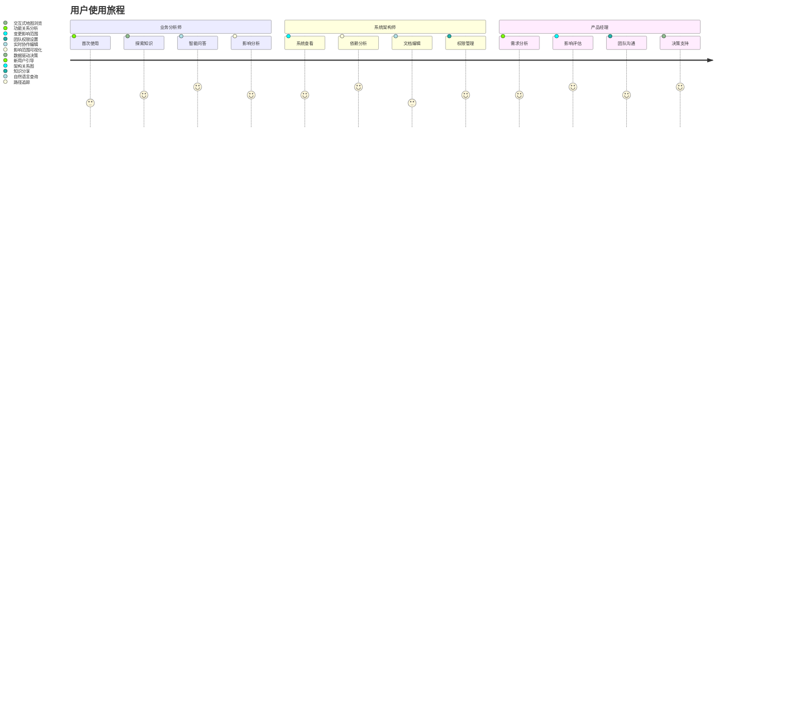
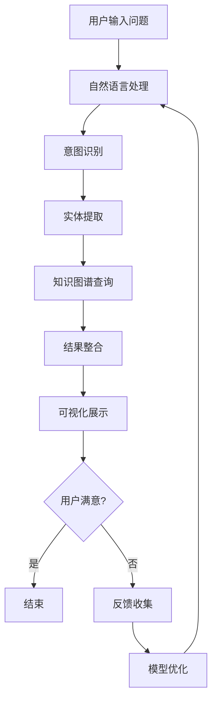
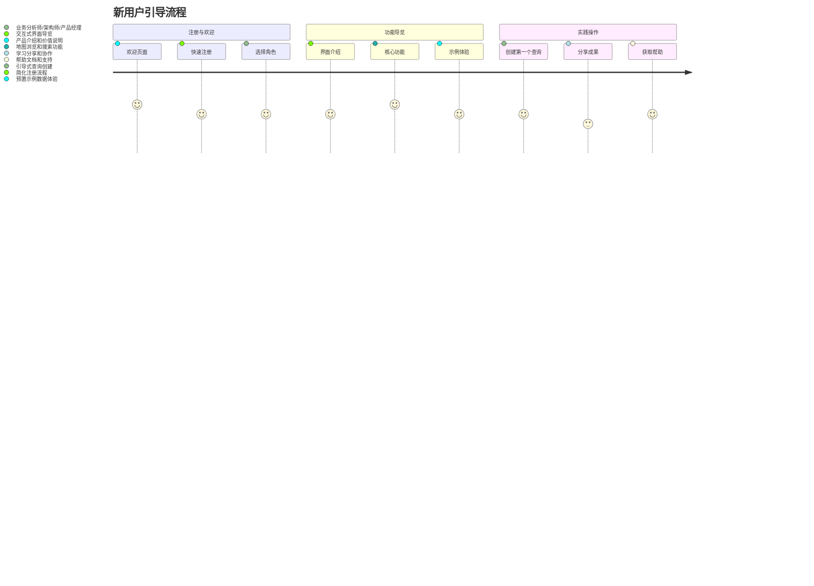

# EFIAgent知识地图 - 详细产品设计

## 1. 产品概览

### 1.1 产品定位
**EFIAgent知识地图** - 企业知识可视化与智能问答平台，让复杂的业务概念和系统关系变得像使用地图一样简单直观。

### 1.2 设计理念
- **直观性** - 一目了然的可视化展示
- **易用性** - 5分钟快速上手，3次点击完成操作
- **实用性** - 解决实际业务问题，创造真实价值
- **协作性** - 团队共建，知识共享

### 1.3 核心用户旅程



## 2. 详细功能设计

### 2.1 知识地图可视化

#### 2.1.1 主界面布局

```
┌─────────────────────────────────────────────────────────────┐
│  EFIAgent 知识地图                          [🔍搜索] [👤用户] │
├─────────────────────────────────────────────────────────────┤
│ [🗺️地图] [🔍搜索] [📊分析] [👥协作] [⚙️设置]                │
├─────────────────────────────────────────────────────────────┤
│                                                             │
│  ┌─────────────────┐  ┌─────────────────┐  ┌─────────────┐ │
│  │   视图控制       │  │   筛选器         │  │   时间轴     │ │
│  │ 🔍缩放          │  │ □业务流程       │  │ ──●──────►   │ │
│  │ 🔄旋转          │  │ □IT系统        │  │ 1月        1月│ │
│  │ 🏠重置          │  │ □部门组织       │  │ 15日       1日 │ │
│  │ 💾保存视图       │  │ □产品功能       │  │             │ │
│  └─────────────────┘  └─────────────────┘  └─────────────┘ │
│                                                             │
│  ┌─────────────────────────────────────────────────────┐   │
│  │                                                     │   │
│  │              🗺️ 交互式知识网络图                    │   │
│  │                                                     │   │
│  │  [销售订单]─────→[库存管理]                        │   │
│  │     │            │                                 │   │
│  │     ↓            ↓                                 │   │
│  │  [支付系统]←──[物流配送]                           │   │
│  │                                                     │   │
│  └─────────────────────────────────────────────────────┘   │
│                                                             │
│  ┌─────────────────┐  ┌─────────────────┐  ┌─────────────┐ │
│  │   节点详情       │  │   关系说明       │  │   操作面板   │ │
│  │ 名称: 销售订单   │  │ 类型: 依赖关系   │  │ [➕添加]    │ │
│  │ 类型: 业务流程   │  │ 强度: 0.85      │  │ [✏️编辑]    │ │
│  │ 部门: 销售部     │  │ 频率: 实时      │  │ [🔗链接]    │ │
│  │ 状态: 活跃       │  │ 描述: ...       │  │ [📤分享]    │ │
│  └─────────────────┘  └─────────────────┘  └─────────────┘ │
└─────────────────────────────────────────────────────────────┘
```

#### 2.1.2 交互式地图功能

**节点交互：**
- **点击节点** - 显示详细信息面板
- **双击节点** - 进入节点详情页面
- **拖拽节点** - 自由调整布局
- **右键节点** - 显示上下文菜单
- **悬停节点** - 显示快速信息卡片

**边交互：**
- **点击边** - 高亮显示关系路径
- **双击边** - 显示关系详细信息
- **悬停边** - 显示关系标签

**视图控制：**
- **鼠标滚轮** - 缩放视图
- **拖拽空白区域** - 平移视图
- **Ctrl+拖拽** - 框选多个节点
- **双击空白区域** - 重置视图

#### 2.1.3 多层级可视化

**层级结构：**
```
L1: 企业整体视图
├── L2: 业务域视图 (销售域、财务域、运营域等)
    ├── L3: 业务流程视图 (订单流程、客户流程等)
        ├── L4: 系统组件视图 (具体系统和服务)
            └── L5: 技术细节视图 (API、数据库等)
```

**层级切换机制：**
- **向下钻取** - 双击节点进入下一层级
- **向上返回** - 点击面包屑导航
- **层级指示器** - 显示当前位置
- **快速跳转** - 通过搜索框直接跳转到任意层级

### 2.2 智能搜索与问答

#### 2.2.1 搜索界面设计

```
┌─────────────────────────────────────────────────────────────┐
│ 🔍 搜索企业知识                              [⚙️高级搜索]    │
├─────────────────────────────────────────────────────────────┤
│                                                             │
│  ┌─────────────────────────────────────────────────────┐   │
│  │ 销售订单处理涉及哪些系统？                            │   │
│  │                                                     │   │
│  └─────────────────────────────────────────────────────┘   │
│                                                             │
│  🔮 智能建议                                               │
│  ┌─────────────┐ ┌─────────────┐ ┌─────────────┐           │
│  │ 销售订单     │ │ 库存管理系统 │ │ 支付系统     │           │
│  │ 相关业务     │ │ 依赖关系     │ │ 集成方案     │           │
│  └─────────────┘ └─────────────┘ └─────────────┘           │
│                                                             │
│  💬 最近搜索                                               │
│  • "用户注册流程"                                         │
│  • "系统依赖关系"                                         │
│  • "财务报表系统"                                         │
│                                                             │
│  🔥 热门问题                                               │
│  • 新功能开发影响范围如何评估？                            │
│  • 从用户注册到购买的最短路径是什么？                      │
│  • 哪些系统被多个业务流程共享？                            │
│                                                             │
└─────────────────────────────────────────────────────────────┘
```

#### 2.2.2 智能问答流程



#### 2.2.3 答案展示格式

**文本答案：**
```
销售订单处理主要涉及以下5个系统：

📦 订单管理系统 (OMS) - 核心系统
• 功能：订单创建、状态跟踪、订单管理
• 技术栈：Java + Spring Boot + MySQL

🏪 库存管理系统 (WMS) - 依赖系统
• 功能：库存检查、预留库存、出库管理
• 技术栈：Python + Django + PostgreSQL

💳 支付系统 (Payment) - 集成系统
• 功能：支付处理、退款管理、对账
• 技术栈：Node.js + Express + Redis
```

**可视化答案：**
- 交互式流程图展示
- 高亮关键路径
- 时间轴显示处理步骤
- 系统间数据流向箭头

### 2.3 关系分析功能

#### 2.3.1 分析界面

```
┌─────────────────────────────────────────────────────────────┐
│ 📊 关系分析                                          [📥导出] │
├─────────────────────────────────────────────────────────────┤
│                                                             │
│  🎯 分析目标                                               │
│  ┌─────────────────┐  ┌─────────────────┐                  │
│  │ 源实体           │  │ 目标实体         │                  │
│  │ [销售订单      ▼] │  → [客户信息    ▼] │                  │
│  └─────────────────┘  └─────────────────┘                  │
│                                                             │
│  🔍 分析类型                                               │
│  ☑️ 直接关系     ☑️ 间接关系     ☑️ 影响范围                  │
│  ☑️ 路径分析     ☑️ 关联度计算    ☐ 异常检测                  │
│                                                             │
│  📈 分析结果                                               │
│  ┌─────────────────────────────────────────────────────┐   │
│  │ 🔗 发现的关系路径                                    │   │
│  │                                                     │   │
│  │ 销售订单 → 客户信息                                   │   │
│  │ 强度: 0.92 (强关联)                                  │   │
│  │ 路径长度: 1 (直接关系)                                │   │
│  │ 影响类型: 数据依赖                                   │   │
│  │                                                     │   │
│  │ 📊 影响范围分析                                      │   │
│  │ • 直接影响: 3个业务流程                               │   │
│  │ • 间接影响: 8个相关系统                               │   │
│  │ • 风险等级: 中等                                     │   │
│  └─────────────────────────────────────────────────────┘   │
│                                                             │
└─────────────────────────────────────────────────────────────┘
```

#### 2.3.2 高级分析功能

**路径分析算法：**
- **最短路径** - Dijkstra算法
- **所有路径** - 深度优先搜索
- **影响传播** - 图神经网络分析
- **关键节点** - PageRank算法

**关联度计算：**
- **直接关联** - 邻接关系强度
- **间接关联** - 路径权重累积
- **语义关联** - 文本相似度计算
- **时序关联** - 时间序列相关性

### 2.4 协作管理功能

#### 2.4.1 编辑界面

```
┌─────────────────────────────────────────────────────────────┐
│ ✏️ 编辑: 销售订单                                    [💾保存] │
├─────────────────────────────────────────────────────────────┤
│                                                             │
│  📝 基本信息                                               │
│  ┌─────────────────┐  ┌─────────────────┐                  │
│  │ 名称:           │  │ 类型:           │                  │
│  │ [销售订单      ] │  │ [业务流程     ▼] │                  │
│  └─────────────────┘  └─────────────────┘                  │
│                                                             │
│  📄 描述                                                   │
│  ┌─────────────────────────────────────────────────────┐   │
│  │ 客户购买产品的完整业务流程，从下单到收货的全过程。      │   │
│  │ 涉及订单创建、支付处理、库存检查、物流配送等环节。      │   │
│  │                                                     │   │
│  └─────────────────────────────────────────────────────┘   │
│                                                             │
│  🏷️ 标签                                                   │
│  [核心流程] [B2B] [在线] [⚪添加标签]                        │
│                                                             │
│  👥 协作者                                                 │
│  [👤张三] [👤李四] [👤王五] [➕添加协作者]                     │
│                                                             │
│  📊 统计信息                                               │
│  • 创建时间: 2024-01-15 10:30                              │
│  • 最后修改: 2024-01-20 14:25 (by 李四)                    │
│  • 查看次数: 156                                           │
│  • 编辑次数: 8                                             │
│                                                             │
└─────────────────────────────────────────────────────────────┘
```

#### 2.4.2 实时协作功能

**实时编辑：**
- **多人同时编辑** - 基于WebSocket实时同步
- **冲突检测** - 自动识别编辑冲突
- **版本合并** - 智能合并编辑内容
- **操作历史** - 完整的编辑轨迹记录

**评论系统：**
```markdown
💬 评论与讨论

张三 2024-01-20 10:15
┌─────────────────────────────────────────┐
│ 这个描述很清楚，建议增加处理时间信息     │
│ └─ [回复] [👍] [❤️]                      │
└─────────────────────────────────────────┘

李四 2024-01-20 10:18
┌─────────────────────────────────────────┐
│ @张三 好建议，我已经添加了处理时间信息   │
│ └─ [回复] [👍] [❤️]                      │
└─────────────────────────────────────────┘
```

**权限管理：**
- **查看权限** - 只读访问
- **编辑权限** - 可修改内容
- **管理权限** - 可修改权限设置
- **所有者权限** - 完全控制

## 3. 用户体验设计

### 3.1 新用户引导

#### 3.1.1 首次使用流程



#### 3.1.2 引导界面设计

```
┌─────────────────────────────────────────────────────────────┐
│  🎉 欢迎使用EFIAgent知识地图!                              │
├─────────────────────────────────────────────────────────────┤
│                                                             │
│  🚀 5分钟快速上手                                           │
│                                                             │
│  ┌─────────────┐ ┌─────────────┐ ┌─────────────┐           │
│  │ ① 浏览地图   │ │ ② 智能搜索   │ │ ③ 协作编辑   │           │
│  │             │ │             │ │             │           │
│  │ 拖拽和缩放    │ │ 自然语言查询  │ │ 团队共建     │           │
│  │ 探索知识网络  │ │ 获得智能答案  │ │ 维护知识库   │           │
│  └─────────────┘ └─────────────┘ └─────────────┘           │
│                                                             │
│  ✨ 试试这个例子                                            │
│  ┌─────────────────────────────────────────────────────┐   │
│  │ 🔍 在搜索框输入: "销售订单处理涉及哪些系统？"        │   │
│  │                                                     │   │
│  │ 🗺️ 或者直接拖拽地图，探索业务概念之间的关系           │   │
│  └─────────────────────────────────────────────────────┘   │
│                                                             │
│  [🚀 开始体验] [📚 查看教程] [⏭️ 跳过引导]                 │
│                                                             │
└─────────────────────────────────────────────────────────────┘
```

### 3.2 响应式设计

#### 3.2.1 桌面端布局

```
┌─────────────────────────────────────────────────────────────┐
│  导航栏 (60px)                                              │
├───────────┬─────────────────────────────────────────────────┤
│           │                                                 │
│  侧边栏    │              主内容区域                         │
│ (240px)   │                                                 │
│           │                                                 │
│  • 地图    │              🗺️ 交互式地图                     │
│  • 搜索    │                                                 │
│  • 分析    │                                                 │
│  • 协作    │                                                 │
│  • 设置    │                                                 │
│           │                                                 │
├───────────┴─────────────────────────────────────────────────┤
│  状态栏 (30px)                                              │
└─────────────────────────────────────────────────────────────┘
```

#### 3.2.2 移动端布局

```
┌─────────────────────────────────────────────────────────────┐
│  顶部导航 (56px)                                            │
├─────────────────────────────────────────────────────────────┤
│                                                             │
│  🗺️ 知识地图                                              │
│                                                             │
│  ┌─────────────────────────────────────────────────────┐   │
│  │                                                     │   │
│  │               移动端地图视图                        │   │
│  │                                                     │   │
│  │          [适配触摸操作]                             │   │
│  │                                                     │   │
│  └─────────────────────────────────────────────────────┘   │
│                                                             │
│  底部导航栏 (56px)                                         │
│  [🗺️] [🔍] [📊] [👤]                                      │
│                                                             │
└─────────────────────────────────────────────────────────────┘
```

### 3.3 可访问性设计

#### 3.3.1 键盘导航
- **Tab顺序** - 合理的焦点顺序
- **快捷键** - 常用功能快捷键
- **焦点指示** - 清晰的焦点状态
- **跳过链接** - 跳过导航直接到内容

#### 3.3.2 视觉辅助
- **高对比度** - 支持高对比度模式
- **字体缩放** - 支持字体大小调整
- **屏幕阅读器** - ARIA标签支持
- **色彩辅助** - 不仅依赖颜色传达信息

#### 3.3.3 多语言支持
- **界面国际化** - 中英文界面切换
- **内容本地化** - 术语翻译统一
- **RTL支持** - 从右到左语言支持
- **时区处理** - 本地化时间显示

## 4. 性能与安全设计

### 4.1 性能优化

#### 4.1.1 前端性能
- **代码分割** - 按需加载模块
- **图片优化** - WebP格式和懒加载
- **缓存策略** - 浏览器缓存和CDN
- **虚拟化** - 大数据集虚拟滚动

#### 4.1.2 后端性能
- **数据库优化** - 索引和查询优化
- **缓存机制** - Redis多级缓存
- **异步处理** - 非阻塞I/O操作
- **负载均衡** - 水平扩展支持

### 4.2 安全设计

#### 4.2.1 数据安全
- **数据加密** - 传输和存储加密
- **访问控制** - 基于角色的权限
- **审计日志** - 操作记录追踪
- **备份恢复** - 数据备份策略

#### 4.2.2 网络安全
- **HTTPS** - 强制HTTPS传输
- **CSRF防护** - 跨站请求伪造防护
- **XSS防护** - 跨站脚本攻击防护
- **SQL注入** - 参数化查询防护

这个详细的产品设计为EFIAgent知识地图提供了完整的用户体验和功能实现指导，确保产品能够真正满足用户需求，创造实际的业务价值。