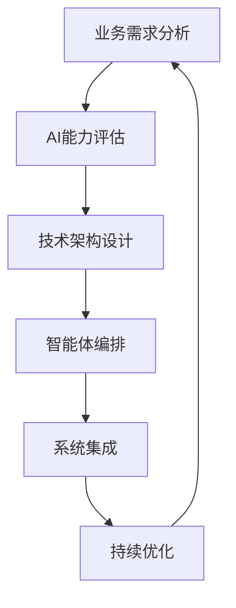

# EFIAgent AI应用方法论 2.0
## 基于能力系统模型的下一代企业级智能协作生态指南

---

## 方法论概述

基于EFIAgent 2.0能力系统模型的深度实践，我们提出了全新的**"智能能力交响曲"**AI应用方法论。该方法论以能力系统化建模为核心，通过认知、推理、决策、学习四大能力维度的系统化集成，构建自适应、可进化的企业级智能协作生态。

### 核心理念：EFIC 2.0原则

- **E**volutionary（进化性）：基于元学习的自主能力进化和优化
- **F**ederated（联邦性）：支持跨组织、跨域的能力共享和协作治理
- **I**ntelligent（智能性）：多模态智能融合的深度认知和推理能力
- **C**apability-driven（能力驱动）：以能力为中心的系统化建模和动态编排

### 能力系统模型框架

```
能力系统模型层次结构：

┌─────────────────────────────────────────────────────────┐
│                   能力应用层                              │
│  业务场景适配 │ 用户交互界面 │ 效果评估反馈              │
├─────────────────────────────────────────────────────────┤
│                   能力编排层                              │
│  任务规划器   │ 能力调度器   │ 协作协调器 │ 性能优化器   │
├─────────────────────────────────────────────────────────┤
│                   核心能力层                              │
│  认知能力     │ 推理能力     │ 决策能力   │ 学习能力     │
├─────────────────────────────────────────────────────────┤
│                   能力来源层                              │
│  输入工具集成 │ 大模型集成   │ 知识图谱系统              │
├─────────────────────────────────────────────────────────┤
│                   基础设施层                              │
│  计算资源     │ 存储系统     │ 网络通信   │ 安全管理     │
└─────────────────────────────────────────────────────────┘
```

---

## 一、战略层：基于能力系统模型的AI应用顶层设计

### 1.1 能力驱动的AI战略规划

#### 能力价值矩阵

| 应用场景 | 核心能力组合 | 技术实现路径 | 预期ROI |
|---------|-------------|-------------|--------|
| 智能制造 | 认知+决策+学习 | 多模态感知+实时决策+持续优化 | 15个月回本 |
| 金融风控 | 推理+决策+知识图谱 | 因果推理+风险决策+动态知识更新 | 10个月回本 |
| 智慧医疗 | 认知+推理+协作 | 医学影像理解+诊断推理+多专家协作 | 20个月回本 |
| 智能客服 | 认知+推理+学习 | 自然语言理解+意图推理+对话学习 | 8个月回本 |

#### 能力成熟度评估模型

```python
class CapabilityMaturityModel:
    """能力成熟度评估模型"""
    
    def __init__(self):
        self.maturity_levels = {
            1: "初始级 - 基础能力部署",
            2: "管理级 - 能力标准化", 
            3: "定义级 - 能力集成化",
            4: "量化级 - 能力优化化",
            5: "优化级 - 能力自进化"
        }
        
    def assess_capability_maturity(self, capability_metrics: Dict) -> Dict[str, int]:
        """评估各项能力的成熟度等级"""
        maturity_scores = {}
        
        for capability, metrics in capability_metrics.items():
            score = self._calculate_maturity_score(metrics)
            maturity_scores[capability] = score
            
        return maturity_scores
```

#### 战略实施路径



### 1.2 组织能力建设

#### 人才梯队构建
- **AI架构师**：负责整体技术架构和智能体设计
- **业务分析师**：负责业务需求转化和价值评估
- **智能体工程师**：负责具体智能体开发和调优
- **运维专家**：负责系统部署、监控和维护

---

## 二、架构层：基于能力系统模型的五层技术范式

### 2.1 五层架构设计原则

#### 用户交互层（User Interface Layer）
- **可视化设计器**：拖拽式能力编排和Agent设计
- **管理控制台**：系统监控、资源管理和性能分析
- **API网关**：统一接口管理和服务路由
- **开发者工具**：SDK、调试工具和文档支持

#### 能力编排层（Capability Orchestration Layer）
- **任务规划器**：复杂任务分解和执行计划生成
- **能力调度器**：智能能力匹配和资源分配
- **协作协调器**：多Agent协作和冲突解决
- **性能优化器**：实时性能监控和自动优化

```python
# 能力编排引擎示例
class CapabilityOrchestrationEngine:
    def __init__(self):
        self.task_planner = TaskPlanner()
        self.capability_scheduler = CapabilityScheduler()
        self.collaboration_coordinator = CollaborationCoordinator()
        self.performance_optimizer = PerformanceOptimizer()
    
    def orchestrate_capabilities(self, task_description: str, context: Dict) -> Dict[str, Any]:
        """能力编排主流程"""
        # 任务分析和规划
        task_plan = self.task_planner.generate_plan(task_description, context)
        
        # 能力匹配和调度
        capability_allocation = self.capability_scheduler.allocate_capabilities(task_plan)
        
        # 协作协调
        coordination_result = self.collaboration_coordinator.coordinate(
            capability_allocation, task_plan
        )
        
        # 性能优化
        optimized_result = self.performance_optimizer.optimize(coordination_result)
        
        return optimized_result
```

#### 核心能力层（Core Capabilities Layer）
- **认知能力模块**：感知处理、语义理解、上下文整合
- **推理能力模块**：逻辑推理、因果推理、概率推理
- **决策能力模块**：战略决策、自适应决策、协作决策
- **学习能力模块**：监督学习、强化学习、迁移学习

#### 能力来源层（Capability Source Layer）
- **输入工具集成**：多模态处理器、传感器接口、API连接器
- **大模型集成**：通用LLM、专业模型、多模态模型
- **知识图谱系统**：本体层、事实层、规则层、时序层

#### 基础设施层（Infrastructure Layer）
- **计算资源**：边缘节点、云端集群、GPU加速
- **存储系统**：分布式存储、缓存系统、数据湖
- **网络通信**：消息队列、API网关、负载均衡
- **安全管理**：身份认证、权限控制、审计日志

### 2.2 通信协议栈优化

#### 分层通信设计

```python
# 轻量级消息协议实现
class LayeredProtocol:
    def __init__(self):
        self.control_layer = ControlLayer()  # 2字节二进制头部
        self.semantic_layer = SemanticLayer()  # JSON-LD结构化消息
        self.data_layer = DataLayer()  # 差分压缩传输
    
    def encode_message(self, intent: str, params: Dict, data: Any) -> bytes:
        """编码分层消息"""
        # 控制层：优先级和路由信息
        control_header = self.control_layer.create_header(
            priority=self.calculate_priority(intent),
            routing_info=self.get_routing_info()
        )
        
        # 语义层：意图和参数
        semantic_content = self.semantic_layer.create_content(
            intent=intent,
            parameters=params
        )
        
        # 数据层：差分压缩
        data_payload = self.data_layer.compress_delta(
            current_data=data,
            base_state=self.get_base_state()
        )
        
        return control_header + semantic_content + data_payload
```

---

## 三、实现层：基于能力系统模型的工程化实践

### 3.1 能力系统化设计模式

#### 能力模块化设计（Capability Modularization Design）

```python
# 能力模块基类
class CapabilityModule:
    def __init__(self, capability_type: str, capability_config: Dict):
        self.capability_type = capability_type
        self.config = capability_config
        self.performance_metrics = PerformanceMetrics()
        self.learning_history = LearningHistory()
    
    def execute(self, input_data: Dict, context: Dict) -> Dict[str, Any]:
        """执行能力模块的核心功能"""
        raise NotImplementedError
    
    def learn_from_feedback(self, feedback: Dict) -> None:
        """从反馈中学习优化"""
        self.learning_history.add_feedback(feedback)
        self._update_capability_parameters(feedback)
    
    def get_capability_vector(self) -> List[float]:
        """获取能力向量表示"""
        return self._encode_capability_to_vector()

# 认知能力模块实现
class CognitiveCapabilityModule(CapabilityModule):
    def __init__(self, config: Dict):
        super().__init__("cognitive", config)
        self.perception_processor = PerceptionProcessor()
        self.semantic_analyzer = SemanticAnalyzer()
        self.context_integrator = ContextIntegrator()
    
    def execute(self, input_data: Dict, context: Dict) -> Dict[str, Any]:
        """执行认知处理"""
        # 感知处理
        perception_result = self.perception_processor.process(input_data)
        
        # 语义理解
        semantic_result = self.semantic_analyzer.analyze(perception_result)
        
        # 上下文整合
        integrated_result = self.context_integrator.integrate(
            semantic_result, context
        )
        
        return integrated_result

# 推理能力模块实现
class ReasoningCapabilityModule(CapabilityModule):
    def __init__(self, config: Dict):
        super().__init__("reasoning", config)
        self.logical_reasoner = LogicalReasoner()
        self.causal_reasoner = CausalReasoner()
        self.probabilistic_reasoner = ProbabilisticReasoner()
    
    def execute(self, input_data: Dict, context: Dict) -> Dict[str, Any]:
        """执行推理处理"""
        reasoning_type = self._determine_reasoning_type(input_data, context)
        
        if reasoning_type == "logical":
            return self.logical_reasoner.reason(input_data, context)
        elif reasoning_type == "causal":
            return self.causal_reasoner.reason(input_data, context)
        elif reasoning_type == "probabilistic":
            return self.probabilistic_reasoner.reason(input_data, context)
        else:
            return self._hybrid_reasoning(input_data, context)
```

#### 能力组合设计（Capability Composition Design）

```python
# 能力组合器
class CapabilityComposer:
    def __init__(self):
        self.capability_registry = CapabilityRegistry()
        self.composition_optimizer = CompositionOptimizer()
    
    def compose_capabilities(self, task_requirements: Dict, 
                           available_capabilities: List[CapabilityModule]) -> Dict[str, Any]:
        """智能组合能力模块"""
        # 需求分析
        requirement_analysis = self._analyze_requirements(task_requirements)
        
        # 能力匹配
        capability_matches = self._match_capabilities(
            requirement_analysis, available_capabilities
        )
        
        # 组合优化
        optimal_composition = self.composition_optimizer.optimize(
            capability_matches, task_requirements
        )
        
        return optimal_composition
    
    def execute_composed_capabilities(self, composition: Dict, 
                                    input_data: Dict, context: Dict) -> Dict[str, Any]:
        """执行组合后的能力"""
        execution_plan = composition['execution_plan']
        results = {}
        
        for step in execution_plan:
            capability = step['capability']
            step_input = self._prepare_step_input(step, input_data, results)
            step_result = capability.execute(step_input, context)
            results[step['id']] = step_result
            
        return self._aggregate_results(results, composition)
```

#### 协作模式设计

1. **主从协作模式**
   - 适用场景：层次化任务分解
   - 实现方式：规划智能体作为主控，执行智能体作为从属
   - 优势：清晰的责任边界，易于管理和调试

2. **对等协作模式**
   - 适用场景：分布式决策和协商
   - 实现方式：基于共识算法的平等协作
   - 优势：高容错性，无单点故障

3. **市场协作模式**
   - 适用场景：资源竞争和动态分配
   - 实现方式：基于博弈论的激励机制
   - 优势：自动优化资源配置，提高整体效率

### 3.2 资源调度与性能优化

#### 弹性资源池化

```python
# 动态资源分配算法
def dynamic_allocation(task_priority: float, agent_trust: float, 
                      current_load: Dict[str, float]) -> str:
    """
    基于任务关键度、智能体信用评分和当前负载动态分配资源
    
    Args:
        task_priority: 任务优先级 (0.0-1.0)
        agent_trust: 智能体信用评分 (0.0-1.0)
        current_load: 当前系统负载
    
    Returns:
        str: 分配的资源池标识
    """
    # 高优先级高信任任务分配加速资源
    if task_priority > 0.8 and agent_trust > 0.9:
        if current_load.get('gpu_cluster', 0) < 0.7:
            return "GPU_Cluster"
    
    # 中等优先级任务分配CPU集群
    if task_priority > 0.5:
        if current_load.get('cpu_cluster', 0) < 0.8:
            return "CPU_Cluster"
    
    # 低优先级任务使用边缘资源
    return "Edge_Pool"
```

#### 博弈论激励模型

```python
# 贡献-收益函数设计
class IncentiveModel:
    def __init__(self):
        self.contribution_weight = 0.6
        self.quality_weight = 0.4
    
    def calculate_contribution(self, shared_cpu_time: float, 
                             task_criticality: float) -> float:
        """计算智能体贡献值"""
        return shared_cpu_time * task_criticality * self.contribution_weight
    
    def calculate_reward(self, task_acceleration: float, 
                        credit_bonus: float) -> float:
        """计算智能体收益值"""
        return (task_acceleration + credit_bonus) * self.quality_weight
    
    def update_incentive(self, agent_id: str, contribution: float, 
                        reward: float) -> None:
        """更新激励机制"""
        # 更新智能体信用评分
        current_credit = self.get_agent_credit(agent_id)
        new_credit = current_credit + (reward - contribution) * 0.1
        self.update_agent_credit(agent_id, new_credit)
```

---

## 四、应用层：领域特化的解决方案

### 4.1 工业控制场景

#### 边缘-云协同架构

```python
# 边缘智能体实现
class EdgeControlAgent(BaseAgent):
    def __init__(self, config: AgentConfig):
        super().__init__(config)
        self.sensor_manager = SensorManager()
        self.actuator_controller = ActuatorController()
        self.local_model = LightweightModel()
    
    def real_time_control(self, sensor_data: Dict[str, float]) -> Dict[str, float]:
        """实时控制逻辑（<10ms响应）"""
        # 本地模型推理
        control_signals = self.local_model.predict(sensor_data)
        
        # 安全检查
        if self.safety_check(control_signals):
            return control_signals
        else:
            # 触发安全模式
            return self.emergency_control()
    
    def cloud_sync(self) -> None:
        """与云端智能体同步（异步）"""
        # 上传运行数据
        self.upload_telemetry()
        
        # 下载模型更新
        if self.check_model_update():
            self.download_model_update()
```

### 4.2 金融风控场景

#### 多层审核机制

```python
# 风控审核智能体
class RiskAuditAgent(BaseAgent):
    def __init__(self, config: AgentConfig):
        super().__init__(config)
        self.rule_engine = RuleEngine()
        self.ml_detector = MLAnomalyDetector()
        self.knowledge_graph = FinancialKG()
    
    def comprehensive_audit(self, transaction: Transaction) -> AuditResult:
        """综合风险审核"""
        # 规则引擎检查
        rule_result = self.rule_engine.evaluate(transaction)
        
        # 机器学习异常检测
        ml_result = self.ml_detector.detect_anomaly(transaction)
        
        # 知识图谱关联分析
        kg_result = self.knowledge_graph.analyze_relationships(transaction)
        
        # 综合决策
        return self.make_decision(rule_result, ml_result, kg_result)
```

### 4.3 智能运维场景

#### 预测性维护

```python
# 运维记忆智能体
class OpsMemoryAgent(BaseAgent):
    def __init__(self, config: AgentConfig):
        super().__init__(config)
        self.time_series_db = TimeSeriesDB()
        self.pattern_matcher = PatternMatcher()
        self.failure_predictor = FailurePredictor()
    
    def predictive_maintenance(self, system_metrics: Dict[str, List[float]]) -> MaintenanceSchedule:
        """预测性维护调度"""
        # 时序模式识别
        patterns = self.pattern_matcher.identify_patterns(system_metrics)
        
        # 故障预测
        failure_probability = self.failure_predictor.predict(patterns)
        
        # 生成维护计划
        if failure_probability > 0.7:
            return self.generate_urgent_maintenance()
        elif failure_probability > 0.4:
            return self.generate_scheduled_maintenance()
        else:
            return self.generate_routine_maintenance()
```

---

## 五、治理层：安全可控的AI治理体系

### 5.1 零信任安全架构

#### 智能体身份认证

```python
# 零信任认证机制
class ZeroTrustAuth:
    def __init__(self):
        self.identity_verifier = IdentityVerifier()
        self.behavior_analyzer = BehaviorAnalyzer()
        self.risk_assessor = RiskAssessor()
    
    def authenticate_agent(self, agent_id: str, action: AgentAction) -> AuthResult:
        """智能体零信任认证"""
        # 身份验证
        identity_valid = self.identity_verifier.verify(agent_id)
        
        # 行为分析
        behavior_normal = self.behavior_analyzer.is_normal_behavior(
            agent_id, action
        )
        
        # 风险评估
        risk_level = self.risk_assessor.assess_risk(agent_id, action)
        
        # 综合决策
        if identity_valid and behavior_normal and risk_level < 0.3:
            return AuthResult.ALLOW
        elif risk_level < 0.7:
            return AuthResult.MONITOR
        else:
            return AuthResult.DENY
```

#### 差分隐私保护

```python
# 差分隐私实现
class DifferentialPrivacy:
    def __init__(self, epsilon: float = 0.3):
        self.epsilon = epsilon  # 隐私预算
        self.noise_generator = LaplaceNoise()
    
    def add_noise(self, data: np.ndarray) -> np.ndarray:
        """添加拉普拉斯噪声保护隐私"""
        sensitivity = self.calculate_sensitivity(data)
        noise_scale = sensitivity / self.epsilon
        noise = self.noise_generator.generate(data.shape, noise_scale)
        return data + noise
```

### 5.2 可解释性与审计

#### 决策链追踪

```python
# 决策链记录
class DecisionTracker:
    def __init__(self):
        self.decision_chain = []
        self.audit_logger = AuditLogger()
    
    def record_decision(self, agent_id: str, decision: Decision, 
                       reasoning: str) -> None:
        """记录决策过程"""
        decision_record = {
            'timestamp': datetime.now(),
            'agent_id': agent_id,
            'decision': decision.to_dict(),
            'reasoning': reasoning,
            'context': self.get_current_context(),
            'signature': self.sign_decision(decision)
        }
        
        self.decision_chain.append(decision_record)
        self.audit_logger.log(decision_record)
```

---

## 六、进化层：持续学习与优化

### 6.1 三阶段进化协议

#### 阶段一：提示词微调

```python
# 提示词进化
class PromptEvolution:
    def __init__(self):
        self.performance_tracker = PerformanceTracker()
        self.prompt_optimizer = PromptOptimizer()
    
    def evolve_prompts(self, agent_id: str) -> str:
        """基于性能反馈进化提示词"""
        current_performance = self.performance_tracker.get_performance(agent_id)
        
        if current_performance.accuracy < 0.8:
            # 优化提示词
            new_prompt = self.prompt_optimizer.optimize(
                current_prompt=self.get_current_prompt(agent_id),
                performance_data=current_performance,
                domain_knowledge=self.get_domain_knowledge()
            )
            return new_prompt
        
        return self.get_current_prompt(agent_id)
```

#### 阶段二：工作流重构

```python
# 工作流进化
class WorkflowEvolution:
    def __init__(self):
        self.dag_optimizer = DAGOptimizer()
        self.bottleneck_detector = BottleneckDetector()
    
    def evolve_workflow(self, workflow: TaskDAG) -> TaskDAG:
        """基于执行效率重构工作流"""
        # 检测瓶颈
        bottlenecks = self.bottleneck_detector.detect(workflow)
        
        # 优化DAG结构
        if bottlenecks:
            optimized_dag = self.dag_optimizer.optimize(
                original_dag=workflow,
                bottlenecks=bottlenecks,
                resource_constraints=self.get_resource_constraints()
            )
            return optimized_dag
        
        return workflow
```

#### 阶段三：模型热替换

```python
# 模型热替换
class ModelHotSwap:
    def __init__(self):
        self.model_registry = ModelRegistry()
        self.performance_monitor = PerformanceMonitor()
    
    def hot_swap_model(self, agent_id: str) -> bool:
        """无停机模型替换"""
        current_model = self.get_current_model(agent_id)
        candidate_models = self.model_registry.get_candidates(current_model.type)
        
        for candidate in candidate_models:
            if self.performance_monitor.is_better(candidate, current_model):
                # 执行热替换
                self.swap_model(agent_id, candidate)
                return True
        
        return False
```

### 6.2 集体智能涌现

#### 群体学习机制

```python
# 群体学习
class SwarmLearning:
    def __init__(self):
        self.knowledge_distiller = KnowledgeDistiller()
        self.consensus_builder = ConsensusBuilder()
    
    def collective_learning(self, agent_group: List[BaseAgent]) -> None:
        """群体协同学习"""
        # 知识蒸馏
        collective_knowledge = self.knowledge_distiller.distill(
            [agent.get_knowledge() for agent in agent_group]
        )
        
        # 构建共识
        consensus = self.consensus_builder.build_consensus(
            collective_knowledge,
            confidence_threshold=0.8
        )
        
        # 分发更新
        for agent in agent_group:
            agent.update_knowledge(consensus)
```

---

## 七、实施指南：从理论到实践

### 7.1 分阶段实施路线图

#### 第一阶段：基础设施建设（3-6个月）
- 搭建分层联邦架构
- 实现基础通信协议
- 建立智能体注册和发现机制
- 部署监控和日志系统

#### 第二阶段：核心能力构建（6-12个月）
- 开发规划、执行、审核智能体
- 实现任务DAG和资源调度
- 建立知识图谱和规则引擎
- 集成安全认证和隐私保护

#### 第三阶段：业务场景落地（12-18个月）
- 工业控制场景试点
- 金融风控场景验证
- 智能运维场景推广
- 性能优化和稳定性提升

#### 第四阶段：生态扩展（18-24个月）
- 跨组织协作网络
- 智能体市场建设
- 开放API和SDK
- 社区生态培育

### 7.2 关键成功因素

#### 技术层面
1. **架构设计**：确保系统的可扩展性和容错性
2. **性能优化**：持续优化通信效率和资源利用率
3. **安全保障**：建立完善的安全防护和隐私保护机制
4. **质量控制**：建立严格的测试和验证流程

#### 管理层面
1. **团队建设**：培养跨领域的复合型人才
2. **流程规范**：建立标准化的开发和运维流程
3. **风险控制**：识别和管控技术和业务风险
4. **持续改进**：建立反馈机制和优化循环

### 7.3 评估指标体系

#### 技术指标
- **任务完成率**：≥98%（千级节点并发）
- **响应延迟**：<300ms（边缘实时控制）
- **系统容错率**：99.5%（单节点故障）
- **资源利用率提升**：40%（动态负载调度）

#### 业务指标
- **ROI**：12-24个月回本
- **效率提升**：30-50%
- **成本降低**：20-40%
- **用户满意度**：≥90%

---

## 八、未来展望：迈向AGI时代的智能协作

### 8.1 技术发展趋势

#### 量子计算集成
- **量子通信**：QKD量子密钥分发保障通信安全
- **量子优化**：量子算法优化资源分配和任务调度
- **量子机器学习**：量子神经网络提升智能体认知能力

#### 神经符号融合
- **可解释AI**：符号推理增强神经网络的可解释性
- **知识注入**：将领域知识注入到神经网络中
- **混合推理**：结合符号推理和神经网络的优势

#### 人机共进化
- **人类反馈强化学习**：RLHF持续优化智能体行为
- **认知增强**：AI辅助人类决策和创新
- **协同进化**：人机系统的共同学习和适应

### 8.2 应用场景扩展

#### 智慧城市
- **城市大脑**：多智能体协同管理城市资源
- **交通优化**：实时交通流量优化和事故预防
- **环境监测**：空气质量、噪音、能耗的智能监控

#### 科学研究
- **药物发现**：AI辅助新药研发和临床试验
- **材料科学**：智能体协同设计新材料
- **气候建模**：多尺度气候模型的协同计算

#### 教育培训
- **个性化学习**：基于学习者特征的智能教学
- **知识图谱构建**：自动构建领域知识体系
- **技能评估**：智能化的能力测评和认证

### 8.3 社会影响与伦理考量

#### 就业变革
- **新岗位创造**：AI系统设计师、智能体训练师等
- **技能转型**：传统岗位向AI协作方向转型
- **教育改革**：培养AI时代所需的新技能

#### 伦理治理
- **算法公平性**：确保AI决策的公平和无偏见
- **隐私保护**：强化个人数据和隐私的保护
- **责任归属**：明确AI系统决策的责任主体

---

## 结语：构建智能协作的未来

EFIAgent AI应用方法论不仅是一套技术框架，更是面向未来智能社会的战略指南。通过分层联邦架构、智能体协作、持续进化等核心理念，我们正在构建一个能够自我学习、自我优化、自我治理的智能生态系统。

在这个生态系统中，人工智能不再是孤立的工具，而是与人类深度协作的伙伴。智能体之间通过高效的通信协议、精准的能力匹配、公平的激励机制，形成了一个有机的协作网络。这个网络具备了类似生物系统的自组织、自适应、自修复能力，能够在复杂多变的环境中保持稳定和高效。

面向未来，我们相信这套方法论将在更多领域发挥重要作用，推动人工智能从单点突破走向系统性变革，从技术工具升级为智能基础设施，最终实现人机协同、智能协作的美好愿景。

**让我们携手共建智能协作的未来，奏响分布式智能的交响曲！**

---

*本方法论基于EFIAgent项目的深度实践和前沿研究，持续更新中...*

*版本：v1.0*  
*更新时间：2024年12月*  
*作者：EFIAgent团队*