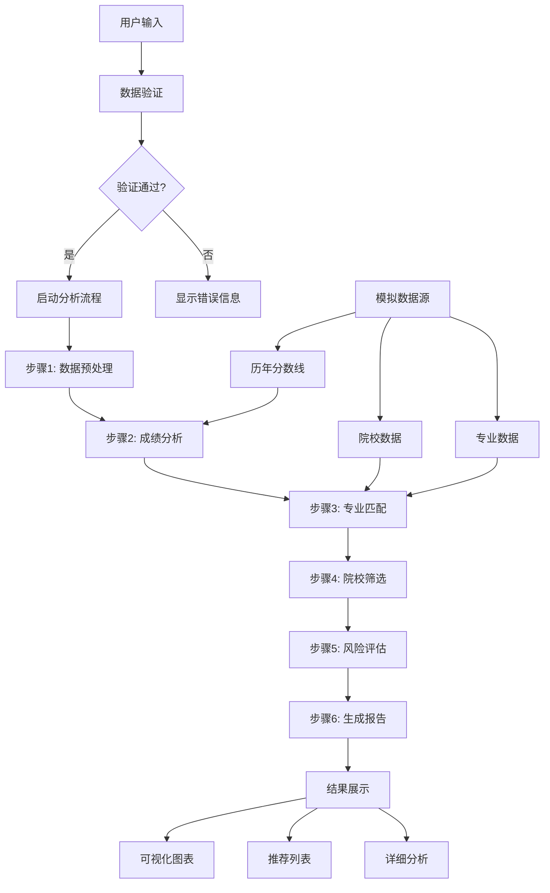
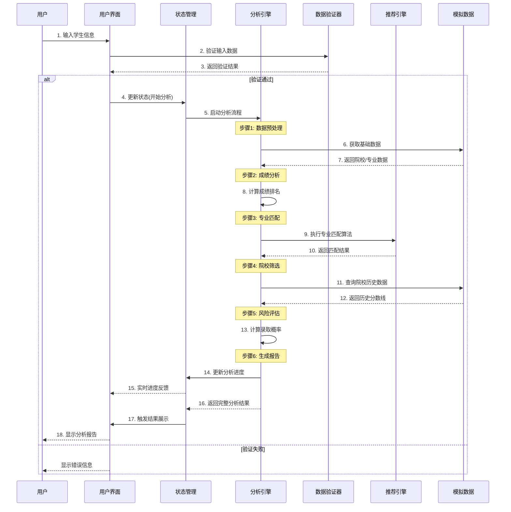
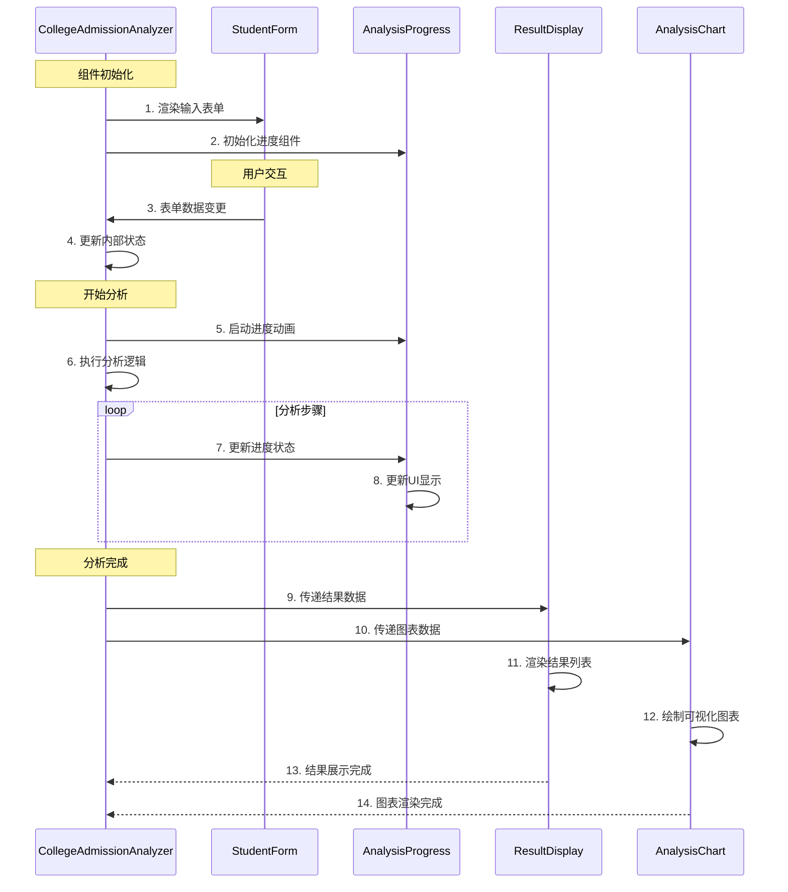

# 高考志愿填报智能分析系统 - 架构与数据流分析

## 📋 系统概述

高考志愿填报智能分析系统是一个基于React的前端应用，集成了智能分析算法、数据可视化和用户交互功能。系统采用组件化架构，通过状态管理和事件驱动实现复杂的业务逻辑。

## 🏗️ 系统架构图

```
┌─────────────────────────────────────────────────────────────────┐
│                    高考志愿填报智能分析系统                        │
├─────────────────────────────────────────────────────────────────┤
│  用户界面层 (UI Layer)                                           │
│  ┌─────────────────┐  ┌─────────────────┐  ┌─────────────────┐ │
│  │   输入表单组件   │  │   结果展示组件   │  │   可视化组件     │ │
│  │  StudentForm    │  │  ResultDisplay  │  │ AnalysisChart   │ │
│  └─────────────────┘  └─────────────────┘  └─────────────────┘ │
├─────────────────────────────────────────────────────────────────┤
│  业务逻辑层 (Business Logic Layer)                               │
│  ┌─────────────────┐  ┌─────────────────┐  ┌─────────────────┐ │
│  │   数据验证器     │  │   分析引擎       │  │   推荐算法       │ │
│  │  DataValidator  │  │ AnalysisEngine  │  │RecommendEngine  │ │
│  └─────────────────┘  └─────────────────┘  └─────────────────┘ │
├─────────────────────────────────────────────────────────────────┤
│  数据管理层 (Data Management Layer)                              │
│  ┌─────────────────┐  ┌─────────────────┐  ┌─────────────────┐ │
│  │   状态管理       │  │   缓存管理       │  │   模拟数据       │ │
│  │  StateManager   │  │  CacheManager   │  │   MockData      │ │
│  └─────────────────┘  └─────────────────┘  └─────────────────┘ │
├─────────────────────────────────────────────────────────────────┤
│  基础设施层 (Infrastructure Layer)                                │
│  ┌─────────────────┐  ┌─────────────────┐  ┌─────────────────┐ │
│  │   React框架      │  │   Ant Design    │  │   Canvas动画     │ │
│  │   React Hooks   │  │   UI组件库       │  │   Animations    │ │
│  └─────────────────┘  └─────────────────┘  └─────────────────┘ │
└─────────────────────────────────────────────────────────────────┘
```

## 🔄 核心数据流图

### 主要数据流向



### 详细数据结构

```typescript
// 学生信息数据结构
interface StudentInfo {
  name: string;           // 学生姓名
  score: number;          // 高考总分
  province: string;       // 所在省份
  category: string;       // 文理科类别
  preferences: string[];  // 专业偏好
  location: string[];     // 地区偏好
}

// 分析结果数据结构
interface AnalysisResult {
  recommendations: CollegeRecommendation[];  // 推荐院校列表
  riskAssessment: RiskLevel;                // 风险评估
  scoreAnalysis: ScoreAnalysis;             // 成绩分析
  trends: TrendData[];                      // 趋势分析
}

// 院校推荐数据结构
interface CollegeRecommendation {
  collegeName: string;    // 院校名称
  major: string;          // 专业名称
  probability: number;    // 录取概率
  riskLevel: 'low' | 'medium' | 'high';  // 风险等级
  lastYearScore: number;  // 去年分数线
  ranking: number;        // 院校排名
}
```

## ⏱️ 系统时序图

### 完整分析流程时序



### 组件交互时序



## 🔧 核心组件详解

### 1. CollegeAdmissionAnalyzer (主组件)

**职责：**
- 整体状态管理
- 协调子组件交互
- 控制分析流程

**关键状态：**
```typescript
const [studentInfo, setStudentInfo] = useState<StudentInfo>();
const [analysisState, setAnalysisState] = useState<AnalysisState>();
const [results, setResults] = useState<AnalysisResult[]>();
const [currentStep, setCurrentStep] = useState<number>(0);
```

### 2. StudentForm (输入组件)

**职责：**
- 收集用户输入
- 数据验证
- 表单状态管理

**数据流：**
```
用户输入 → 实时验证 → 状态更新 → 父组件通知
```

### 3. AnalysisProgress (进度组件)

**职责：**
- 显示分析进度
- 步骤状态管理
- 动画效果控制

**进度步骤：**
1. 数据预处理 (10%)
2. 成绩分析 (25%)
3. 专业匹配 (45%)
4. 院校筛选 (65%)
5. 风险评估 (85%)
6. 生成报告 (100%)

### 4. ResultDisplay (结果展示组件)

**职责：**
- 结果数据展示
- 交互功能实现
- 详情弹窗管理

**展示内容：**
- 推荐院校列表
- 录取概率分析
- 风险等级标识
- 详细信息查看

### 5. AnalysisChart (图表组件)

**职责：**
- 数据可视化
- 图表渲染
- 交互事件处理

**图表类型：**
- 成绩分布图
- 录取概率柱状图
- 专业热度雷达图
- 历年分数线趋势图

## 📊 状态管理策略

### 状态层级结构

```
CollegeAdmissionAnalyzer (根状态)
├── studentInfo (学生信息)
├── analysisState (分析状态)
│   ├── isAnalyzing (是否正在分析)
│   ├── currentStep (当前步骤)
│   ├── progress (进度百分比)
│   └── stepLogs (步骤日志)
├── results (分析结果)
│   ├── recommendations (推荐列表)
│   ├── charts (图表数据)
│   └── summary (总结信息)
└── uiState (界面状态)
    ├── activeTab (当前标签)
    ├── selectedCollege (选中院校)
    └── showDetails (显示详情)
```

### 状态更新流程

```typescript
// 1. 用户输入触发状态更新
const handleStudentInfoChange = (info: StudentInfo) => {
  setStudentInfo(info);
  validateInput(info);
};

// 2. 分析过程中的状态更新
const updateAnalysisProgress = (step: number, progress: number) => {
  setAnalysisState(prev => ({
    ...prev,
    currentStep: step,
    progress: progress,
    stepLogs: [...prev.stepLogs, newLog]
  }));
};

// 3. 结果数据的状态更新
const setAnalysisResults = (results: AnalysisResult) => {
  setResults(results);
  setAnalysisState(prev => ({ ...prev, isAnalyzing: false }));
};
```

## 🎯 性能优化策略

### 1. 组件优化
- 使用 `React.memo` 防止不必要的重渲染
- 合理使用 `useMemo` 和 `useCallback`
- 懒加载非关键组件

### 2. 数据优化
- 虚拟化长列表渲染
- 分页加载大量数据
- 缓存计算结果

### 3. 动画优化
- 使用 `requestAnimationFrame`
- CSS3 硬件加速
- 避免频繁的DOM操作

## 🔒 错误处理机制

### 错误类型分类

```typescript
enum ErrorType {
  VALIDATION_ERROR = 'validation_error',    // 输入验证错误
  ANALYSIS_ERROR = 'analysis_error',        // 分析过程错误
  DATA_ERROR = 'data_error',                // 数据获取错误
  RENDER_ERROR = 'render_error'             // 渲染错误
}

// 错误处理函数
const handleError = (error: Error, type: ErrorType) => {
  console.error(`[${type}]`, error);
  
  switch (type) {
    case ErrorType.VALIDATION_ERROR:
      showValidationMessage(error.message);
      break;
    case ErrorType.ANALYSIS_ERROR:
      resetAnalysisState();
      showErrorDialog('分析过程出现错误，请重试');
      break;
    default:
      showGenericError();
  }
};
```

## 📈 扩展性设计

### 1. 插件化架构
- 分析算法可插拔
- 数据源可配置
- UI主题可切换

### 2. 配置化管理
- 业务规则配置化
- 界面布局配置化
- 数据源配置化

### 3. 国际化支持
- 多语言文本
- 地区化数据
- 文化适配

## 🚀 部署与监控

### 部署策略
- 静态资源CDN加速
- 服务端渲染(SSR)支持
- 渐进式Web应用(PWA)

### 监控指标
- 页面加载时间
- 分析处理耗时
- 用户交互响应时间
- 错误率统计

---

## 📝 总结

高考志愿填报智能分析系统通过清晰的架构分层、合理的数据流设计和完善的组件交互机制，实现了复杂业务逻辑的有效管理。系统具备良好的可维护性、可扩展性和用户体验，为类似的智能分析应用提供了优秀的架构参考。

**核心优势：**
- 🎯 **模块化设计**：组件职责清晰，便于维护和测试
- 🔄 **响应式架构**：状态驱动，数据流向明确
- 🎨 **用户体验**：流畅的交互和实时的反馈
- 🚀 **性能优化**：多层次的优化策略
- 🔧 **可扩展性**：插件化和配置化设计

该系统架构可作为其他智能分析应用的设计模板，通过调整业务逻辑和数据模型，可快速适配不同的应用场景。